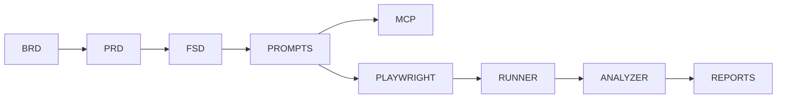

# AI-SDLC – Artificial Intelligence Software Development Lifecycle

---

# Información General

| Campo | Valor |
|--------|--------|
| Documento | AI_SDLC.md |
| Proyecto | UMSS Market |
| Versión | 1.0 |
| Fecha | 06/07/2026 |
| Estado | Aprobado |

---

# 1. Objetivo

Definir el ciclo de vida de desarrollo asistido por Inteligencia Artificial utilizado durante el proyecto UMSS Market.

El AI-SDLC integra documentación, generación automática de pruebas, automatización y análisis inteligente de resultados, garantizando trazabilidad completa desde los requerimientos del negocio hasta la validación funcional.

---

# 2. Visión General

El proceso AI-SDLC incorpora Inteligencia Artificial como apoyo durante todas las fases del desarrollo del software.

```text
Business Need

        │

        ▼

BRD

        │

        ▼

PRD

        │

        ▼

FSD

        │

        ▼

Prompt Contracts

        │

        ▼

AI Agents

        │

        ▼

Código

        │

        ▼

Testing

        │

        ▼

AI Analysis

        │

        ▼

Reports
```

---

# 3. Etapas del AI-SDLC

## 3.1 Business Requirements

Documento:

- BRD v5

Objetivo:

- Definir necesidades del negocio.
- Identificar Stakeholders.
- Definir objetivos estratégicos.

Artefacto generado:

```
BRD_v5.md
```

---

## 3.2 Product Requirements

Documento:

- PRD v4

Objetivo:

- Traducir necesidades del negocio en funcionalidades.

Artefacto:

```
PRD_v4.md
```

---

## 3.3 Functional Specification

Documento:

- FSD v4

Objetivo:

- Especificar funcionalmente cada Caso de Uso.

Casos implementados:

- UC-001
- UC-002
- UC-003
- UC-004 MCP Postman Agent
- UC-005 AI Playwright Testing Agent
- UC-006 AI Test Analyzer

---

## 3.4 Prompt Engineering

Se diseñaron Prompt Contracts para cada etapa.

Documentos:

- PR-BRD-001
- PR-PRD-001
- PR-FSD-001
- PR-FSD-002
- PR-FSD-003
- PR-FSD-004
- PR-MCP-001
- PR-PLAYWRIGHT-001
- PR-AI-ANALYZER-001

Objetivo:

- Garantizar consistencia.
- Reducir ambigüedad.
- Mantener trazabilidad.

---

## 3.5 AI Agents

Se implementaron tres agentes especializados.

### MCP Postman Agent

Responsabilidades:

- Descubrir Workspaces.
- Obtener Collections.
- Ejecutar Newman.

---

### AI Playwright Testing Agent

Responsabilidades:

- Interpretar Features.
- Construir Prompt.
- Generar Playwright.
- Crear archivos .spec.js.

---

### AI Test Analyzer

Responsabilidades:

- Analizar resultados.
- Clasificar errores.
- Generar recomendaciones.
- Crear reportes.

---

## 3.6 Testing

Herramientas utilizadas:

- Newman
- Playwright

Artefactos:

```
generated-tests/

reports/

playwright-results.json

report.html

ai-report.md
```

---

## 3.7 AI Analysis

El análisis inteligente permite:

- Clasificar severidad.
- Detectar causa probable.
- Generar recomendaciones.
- Construir resumen ejecutivo.

---

## 3.8 Evidencias

Cada Feature incorpora evidencia de implementación.

Documentos:

- evidencia_mcp_agent.md
- evidencia_playwright_agent.md
- evidencia_ai_test_analyzer.md

---

# 4. Arquitectura AI-SDLC



---

# 5. Beneficios

- Automatización del SDLC.
- Mayor productividad.
- Reducción del tiempo de desarrollo.
- Mayor trazabilidad.
- Integración continua.
- Testing automatizado.
- Documentación consistente.

---

# 6. Trazabilidad

| Documento | Relación |
|------------|----------|
| BRD v5 | Negocio |
| PRD v4 | Producto |
| FSD v4 | Especificación |
| ADR | Arquitectura |
| DD | Diseño |
| Prompts | Ingeniería de Prompts |
| Código | Implementación |
| Evidencias | Validación |

---

# 7. Conclusiones

El AI-SDLC adoptado por UMSS Market integra Inteligencia Artificial en todas las etapas del ciclo de vida del desarrollo de software, permitiendo mantener coherencia documental, automatizar tareas repetitivas y mejorar el proceso de aseguramiento de calidad mediante agentes especializados para pruebas API, generación automática de pruebas End-to-End y análisis inteligente de resultados.