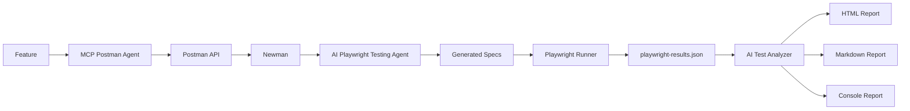

# TESTING PIPELINE – UMSS Market AI Testing Platform

---

# Información General

| Campo | Valor |
|--------|--------|
| Documento | TESTING_PIPELINE.md |
| Proyecto | UMSS Market |
| Versión | 1.0 |
| Fecha | 06/07/2026 |
| Estado | Aprobado |

---

# 1. Objetivo

Documentar el pipeline completo de pruebas automatizadas implementado para la plataforma UMSS Market utilizando Inteligencia Artificial.

El pipeline integra descubrimiento de APIs, generación automática de pruebas End-to-End, ejecución automatizada, análisis inteligente y generación de reportes.

---

# 2. Visión General

La plataforma AI Testing automatiza completamente el ciclo de pruebas.

```text
Feature

    │

    ▼

MCP Postman Agent

    │

    ▼

Postman Collections

    │

    ▼

Newman

    │

    ▼

API Results

    │

    ▼

AI Playwright Testing Agent

    │

    ▼

Generated Playwright Specs

    │

    ▼

Playwright Runner

    │

    ▼

playwright-results.json

    │

    ▼

AI Test Analyzer

    │

    ▼

HTML Report

Markdown Report

Console Report
```

---

# 3. Pipeline

## Etapa 1 — Descubrimiento API

### Objetivo

Localizar automáticamente los recursos disponibles en Postman.

### Componente

MCP Postman Agent

### Actividades

- Autenticación.
- Descubrimiento de Workspaces.
- Descubrimiento de Collections.
- Validación.

---

## Etapa 2 — Ejecución API

### Herramienta

Newman

### Actividades

- Ejecutar Collection.
- Validar respuestas.
- Exportar resultados.

Artefacto generado

```
postman-results.json
```

---

## Etapa 3 — Generación Playwright

### Componente

AI Playwright Testing Agent

### Flujo

Feature

↓

Prompt Builder

↓

AI Service

↓

Playwright Generator

↓

Spec Writer

↓

generated-tests/*.spec.js

---

## Etapa 4 — Ejecución Playwright

### Herramienta

Playwright

### Actividades

- Ejecutar casos de prueba.
- Validar assertions.
- Generar JSON.

Artefacto

```
playwright-results.json
```

---

## Etapa 5 — AI Test Analyzer

### Actividades

- Leer JSON.
- Clasificar errores.
- Detectar causa probable.
- Calcular severidad.
- Generar recomendaciones.

---

## Etapa 6 — Reportes

Artefactos generados

```
reports/

playwright-results.json

report.html

ai-report.md
```

---

# 4. Componentes

| Componente | Responsabilidad |
|------------|-----------------|
| MCP Postman Agent | Descubrimiento y ejecución API |
| Newman | Ejecución de Collections |
| AI Playwright Testing Agent | Generación automática de pruebas |
| Playwright Runner | Ejecución de pruebas |
| AI Test Analyzer | Interpretación de resultados |
| HTML Reporter | Reporte HTML |
| Markdown Reporter | Reporte Markdown |
| Console Reporter | Resumen en consola |

---

# 5. Flujo Arquitectónico



---

# 6. Pipeline Tecnológico

| Etapa | Tecnología |
|---------|----------------|
| Descubrimiento | MCP |
| Integración API | Postman |
| Ejecución API | Newman |
| IA | Mock AI / OpenAI |
| Testing E2E | Playwright |
| Reportes | HTML + Markdown |
| Runtime | Node.js |

---

# 7. Entradas

- Features
- Collections
- Prompt Contracts
- API Keys
- Resultados JSON

---

# 8. Salidas

- generated-tests/*.spec.js
- playwright-results.json
- report.html
- ai-report.md
- Reporte Consola

---

# 9. Métricas

| Indicador | Meta |
|------------|---------|
| Descubrimiento Workspaces | 100% |
| Descubrimiento Collections | 100% |
| Generación Playwright | ≥95% |
| Ejecución Playwright | ≥95% |
| Reportes generados | 100% |
| Automatización | 100% |

---

# 10. Trazabilidad

| Documento | Relación |
|------------|----------|
| BRD v5 | Objetivos del negocio |
| PRD v4 | Requerimientos |
| FSD UC-004 | MCP |
| FSD UC-005 | Playwright |
| FSD UC-006 | Analyzer |
| ADR-0004 | MCP |
| ADR-0005 | Playwright |
| ADR-0006 | Analyzer |
| DD-UC-004 | Diseño MCP |
| DD-UC-005 | Diseño Playwright |
| DD-UC-006 | Diseño Analyzer |

---

# 11. Beneficios

- Automatización completa del proceso de pruebas.
- Eliminación de tareas repetitivas.
- Mayor cobertura de pruebas.
- Generación automática de reportes.
- Reducción del tiempo de validación.
- Integración con AI-SDLC.
- Arquitectura desacoplada.
- Alta mantenibilidad.

---

# 12. Futuras Mejoras

- Integración con GitHub Actions.
- Integración con Azure DevOps.
- Ejecución paralela de pruebas.
- Dashboard de métricas.
- Clasificación automática de defectos mediante LLM.
- Integración con Jira para creación automática de incidencias.

---

# 13. Conclusiones

El Testing Pipeline implementado en UMSS Market integra los tres componentes principales de la plataforma AI Testing: **MCP Postman Agent**, **AI Playwright Testing Agent** y **AI Test Analyzer**.

Esta arquitectura permite automatizar el descubrimiento de APIs, la generación de pruebas End-to-End, la ejecución mediante Playwright y el análisis inteligente de resultados, proporcionando un flujo de trabajo alineado con el enfoque **AI-SDLC** y fortaleciendo el proceso de aseguramiento de calidad del proyecto.