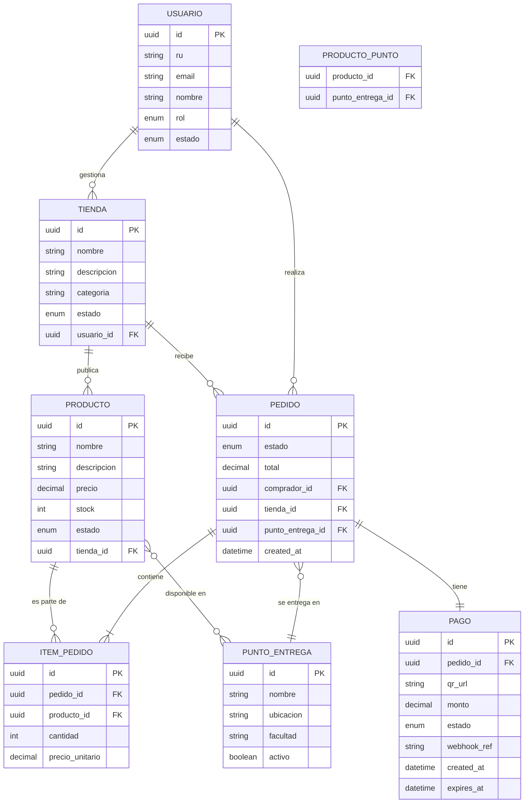

# Functional Specification Document (FSD) — UMSS Market

---

## 0. Metadatos ⚡🔧

| Campo | Valor |
|-------|-------|
| Producto | UMSS Market |
| Grupo | — |
| Versión del documento | v1.0 |
| Fecha | 11/05/2026 |
| Autores | Rodriguez Gonzales Abad Melani, Vargas Sandoval Christian Bernardo |
| Revisores | Docente + 1 grupo par |
| Estado | En revisión |
| **Modo elegido** | **FSD clásico 🔧** |
| Trazabilidad a PRD | PRD v1.0 |
| Insumos M2 (UI/UX) | `informe_heuristica_ecommerce.docx`, `entrevistas_usuarios.docx` |
| Fase Spec Kit cubierta | Specify ✅ / Plan ✅ / Tasks ✅ / Implement ⬜ |
| Prompts utilizados | PR-FSD-001, PR-FSD-002, PR-FSD-003 |

---

## 1. Resumen Ejecutivo ⚡🔧

UMSS Market es una plataforma de comercio electrónico multi-tenant diseñada exclusivamente para la comunidad de la Universidad Mayor de San Simón (UMSS). El sistema centraliza la oferta de productos de emprendedores estudiantiles, automatiza la validación de pagos mediante QR dinámico y sincroniza el inventario en tiempo real, resolviendo la fragmentación e inseguridad del comercio informal actual basado en WhatsApp y redes sociales.

El sistema sirve a tres actores principales: emprendedores universitarios que necesitan gestionar pedidos sin intervención manual, estudiantes compradores que exigen rapidez y seguridad en sus transacciones, y administradores UMSS que supervisan la actividad comercial del campus. El diferencial estratégico radica en la integración con la identidad institucional (Registro Universitario), que elimina el anonimato y previene fraudes, y en la sincronización atómica entre pago, pedido y stock, que garantiza que un pedido confirmado siempre tenga respaldo real. El objetivo medible es reducir el tiempo de transacción de los actuales 3:40 min a menos de 60 segundos, con una tasa de éxito de pagos superior al 98%.

---

## 2. Alcance ⚡🔧

### 2.1 Dentro del alcance

- Registro y validación de emprendedores mediante Registro Universitario (RU).
- Gestión de tiendas multi-tenant: creación, configuración y administración.
- Catálogo de productos: alta, edición, baja lógica e imágenes.
- Gestión de stock con sincronización en tiempo real y bloqueo optimista.
- Flujo completo de pedidos: creación, pago, confirmación y entrega.
- Generación de QR dinámico único por pedido con monto exacto y expiración de 5 minutos.
- Validación automática de pagos mediante Webhook bancario.
- Puntos de encuentro predefinidos por facultad (click & collect).
- Dashboard del vendedor: métricas de ventas, pedidos activos y stock.
- Notificaciones automáticas de cambio de estado de pedido.
- Historial de transacciones con registro inalterable.
- Panel de administración UMSS para supervisión y auditoría.
- Sistema de calificaciones de tiendas y productos (Must para v1).

### 2.2 Fuera del alcance (explícito)

- Delivery externo fuera del campus universitario.
- Integración con tarjetas de crédito/débito internacionales.
- Apertura del marketplace a usuarios externos a la UMSS.
- Módulo de IA avanzada (recomendaciones, chatbot) en esta versión.
- Pagos con efectivo o transferencias manuales.
- Gestión de devoluciones y reembolsos (fase 2).

### 2.3 Supuestos y dependencias

**Supuestos técnicos:**
- Los estudiantes poseen smartphones con acceso a apps bancarias compatibles con QR interoperable boliviano.
- La red Wi-Fi universitaria provee conectividad suficiente en las facultades priorizadas (Tecnología y Economía).
- El banco asociado expone una API REST estable con tiempo de respuesta p95 < 1.5 s para la generación y validación de QR.
- El sistema SIIS (Sistema Institucional de Identidad) de la UMSS expone un endpoint de consulta de RU activo.

**Dependencias externas:**
- API bancaria QR: generación de QR dinámico interoperable (Fase Payments).
- SIIS UMSS: verificación de Registro Universitario en el registro de usuarios.
- Infraestructura cloud (servidores): hosting de la aplicación y base de datos.
- Servicio de notificaciones push (FCM o similar) para alertas de estado de pedido.
- Ley de Servicios Financieros de Bolivia: cumplimiento normativo en manejo de QR y datos financieros.

### 2.4 Plan técnico (Spec Kit fase Plan) 🔧

| Bloque | Contenido |
|--------|-----------|
| **Stack tecnológico** | Backend: Python 3.12 + FastAPI; Frontend: React 18 (responsive PWA); DB: PostgreSQL 16; Cache: Redis 7; Cola de mensajes: RabbitMQ |
| **Arquitectura prevista** | Arquitectura en capas (Layered Architecture): capa de presentación (REST API), capa de aplicación (casos de uso), capa de dominio (entidades y reglas de negocio), capa de infraestructura (repositorios, adaptadores externos) |
| **Project structure** | `backend/` (FastAPI, dominio, infra), `frontend/` (React, componentes, páginas), `infra/` (Docker, CI/CD), `docs/` (FSD, PRD, BRD, ADR) |
| **Decisiones técnicas anticipadas** | Webhook bancario asíncrono para evitar bloqueo en validación de pago; bloqueo optimista de stock con Redis para resolver race conditions; JWT para autenticación con validación de RU en SIIS |
| **Restricciones técnicas** | Multi-tenant con aislamiento de datos por tienda; la BD debe ser relacional para garantizar consistencia transaccional en stock y pagos; sistema responsive (mobile-first) |

### 2.5 Descomposición en Tasks (Spec Kit) ⚡🔧

| Task ID | Descripción | Caso de uso (FSD-UC) | Dependencias | Prompt asociado | Estado |
|---------|-------------|----------------------|--------------|-----------------|--------|
| `T-001` | Modelado de BD: entidades Usuario, Tienda, Producto, Pedido, Pago, PuntoEntrega | — | — | — | pendiente |
| `T-002` | Endpoint `POST /auth/register` con validación de RU en SIIS | `FSD-UC-003` | `T-001` | `PR-FSD-003` | pendiente |
| `T-003` | Endpoint `POST /auth/login` con JWT y roles | `FSD-UC-003` | `T-002` | — | pendiente |
| `T-004` | CRUD de Productos y gestión de stock | `FSD-UC-002` | `T-001` | `PR-FSD-002` | pendiente |
| `T-005` | Endpoint `POST /pedidos` con bloqueo temporal de stock | `FSD-UC-001` | `T-004` | `PR-FSD-001` | pendiente |
| `T-006` | Generación de QR dinámico único por pedido (integración bancaria) | `FSD-UC-001` | `T-005` | `PR-FSD-001` | pendiente |
| `T-007` | Webhook `POST /pagos/webhook` con validación y confirmación atómica | `FSD-UC-001` | `T-006` | `PR-FSD-001` | pendiente |
| `T-008` | Sistema de notificaciones push por cambio de estado | `FSD-UC-001`, `FSD-UC-002` | `T-007` | — | pendiente |
| `T-009` | Dashboard del vendedor: métricas y listado de pedidos | `FSD-UC-002` | `T-007` | — | pendiente |
| `T-010` | Panel de administración UMSS: auditoría y supervisión | `FSD-UC-003` | `T-002`, `T-007` | — | pendiente |

---

## 3. Actores y roles del sistema ⚡🔧

| Actor | Tipo | Responsabilidad principal | Permisos clave |
|-------|------|---------------------------|----------------|
| **Comprador Estudiante** | humano | Buscar productos, crear pedidos y realizar pagos QR | Leer catálogo, crear pedidos, ver historial propio |
| **Emprendedor Estudiante** | humano | Gestionar su tienda, publicar productos y atender pedidos | CRUD de productos propios, ver pedidos de su tienda, gestionar stock |
| **Administrador UMSS** | humano | Supervisar actividad comercial, aprobar tiendas y auditar transacciones | Leer todo, aprobar/suspender tiendas, ver auditoría global |
| **API Bancaria (QR)** | sistema externo | Generar QR dinámico y notificar confirmación de pago vía Webhook | Emitir QR, enviar eventos de pago |
| **SIIS UMSS** | sistema externo | Validar que el Registro Universitario (RU) es activo y pertenece a la UMSS | Consulta de identidad (solo lectura) |
| **Servicio de Notificaciones** | sistema | Enviar alertas push al comprador y vendedor por cambios de estado | Emitir notificaciones push |

---

## 4. Casos de uso funcionales ⚡🔧

### 4.1 FSD-UC-001 – Proceso de Compra con Pago QR Dinámico

- **Trazabilidad**: `PRD-PAY-01`, `UC-01 (PRD)`, `BR-001`, `BR-002`, `BR-003`, `MRD-N-02`
- **Actor principal**: Comprador Estudiante
- **Precondiciones**:
  1. El comprador tiene sesión iniciada con RU verificado.
  2. Los productos en el carrito tienen stock disponible ≥ 1 unidad.
  3. La API bancaria está operativa.
- **Disparador**: El comprador confirma su carrito de compras y presiona "Generar Pedido".
- **Flujo principal**:
  1. El comprador selecciona productos y confirma el carrito.
  2. El sistema valida que todos los productos tienen stock disponible; si alguno no tiene stock, lo notifica y remueve del carrito.
  3. El sistema crea el pedido con estado `PENDIENTE` y bloquea temporalmente el stock en Redis por 5 minutos.
  4. El sistema solicita a la API bancaria la generación de un QR dinámico con el monto exacto del pedido.
  5. El sistema muestra al comprador el QR con un loader de "Esperando pago" y un contador de expiración de 5 minutos.
  6. El comprador escanea el QR con su app bancaria y autoriza el pago.
  7. La API bancaria envía un Webhook al sistema con la confirmación de pago.
  8. El sistema valida el Webhook (firma, monto, unicidad de la transacción) y descuenta el stock de manera atómica en la base de datos.
  9. El sistema actualiza el pedido a estado `PAGADO` y notifica al comprador (confirmación) y al vendedor (nuevo pedido).
  10. El comprador recibe confirmación de compra con detalle del punto de encuentro.
- **Flujos alternativos / excepciones**:
  - `A1 — QR expirado`: Si el QR no es pagado en 5 minutos, el sistema cambia el pedido a `CANCELADO`, libera el bloqueo de stock y notifica al comprador.
  - `A2 — Race condition de stock`: Si el Webhook llega pero el stock se agotó concurrentemente (otro pedido lo tomó), el sistema cancela este pedido, emite una alerta de reembolso y notifica al comprador con mensaje de error claro.
  - `A3 — Webhook duplicado`: Si el sistema recibe dos Webhooks del mismo `webhook_ref`, el segundo es ignorado (idempotencia).
  - `A4 — API bancaria no responde`: Si la generación del QR falla, el sistema muestra error al usuario e invita a reintentar; el pedido permanece en estado `PENDIENTE` sin bloqueo de stock.
- **Postcondiciones**:
  1. El pedido existe en estado `PAGADO` en el historial del comprador.
  2. El stock del/los producto(s) se redujo exactamente en la cantidad comprada.
  3. El vendedor recibe notificación de nuevo pedido en su dashboard.
  4. El pago queda registrado con referencia bancaria inalterable.
- **Reglas de negocio aplicables**: `BR-001`, `BR-002`, `BR-003`, `BR-004`, `BR-006`
- **Datos de entrada**: carrito (lista de `{producto_id, cantidad}`), `punto_entrega_id`, sesión del comprador.
- **Datos de salida**: `pedido_id`, `estado`, `qr_url`, `monto_total`, `expires_at`, `punto_entrega`.
- **Criterios de aceptación**:

```gherkin
Dado   que el comprador tiene un carrito con 2 empanadas (stock = 5) y sesión activa
Cuando confirma el pedido y escanea el QR generado pagando el monto exacto
Entonces el pedido pasa a estado PAGADO, el stock baja a 3, el comprador recibe confirmación y el vendedor recibe alerta

Dado   que el comprador no paga el QR en 5 minutos
Cuando expira el tiempo del QR
Entonces el pedido pasa a CANCELADO y el stock bloqueado es liberado sin descuento

Dado   que dos compradores intentan comprar el último ítem de stock simultáneamente
Cuando ambos pagos son confirmados por el banco
Entonces solo el primero en confirmar recibe el pedido PAGADO; el segundo recibe notificación de stock agotado y aviso de reembolso
```

---

### 4.2 FSD-UC-002 – Publicación y Gestión de Producto

- **Trazabilidad**: `PRD-STK-01`, `UC-02 (PRD)`, `BR-003`, `MRD-N-03`
- **Actor principal**: Emprendedor Estudiante
- **Precondiciones**:
  1. El emprendedor tiene sesión activa con rol `EMPRENDEDOR`.
  2. Su tienda está en estado `ACTIVA` (aprobada por el administrador).
- **Disparador**: El emprendedor accede a su dashboard y selecciona "Agregar Producto".
- **Flujo principal**:
  1. El emprendedor completa el formulario: nombre, descripción, precio, imágenes (máx. 3) y stock inicial (≥ 1).
  2. El sistema valida los campos en tiempo real (RF-05): nombre requerido, precio > 0, stock ≥ 1.
  3. El emprendedor selecciona uno o más puntos de encuentro predefinidos para entrega.
  4. El emprendedor presiona "Publicar".
  5. El sistema guarda el producto en estado `ACTIVO` y lo hace visible en el catálogo.
  6. El sistema confirma la publicación con un mensaje de éxito y redirige al dashboard.
- **Flujos alternativos / excepciones**:
  - `A1 — Stock inicial 0`: El sistema rechaza la publicación con mensaje "El stock inicial debe ser al menos 1" (BR-007).
  - `A2 — Producto sin punto de entrega`: El sistema bloquea la publicación e indica que se debe seleccionar al menos un punto de encuentro.
  - `A3 — Error al subir imagen`: El sistema muestra error parcial pero permite continuar sin imagen; el producto se publica con imagen de placeholder.
- **Postcondiciones**:
  1. El producto aparece visible en el catálogo del marketplace.
  2. El stock inicial queda registrado para sincronización en tiempo real.
  3. Los puntos de encuentro asociados son los únicos disponibles en el flujo de compra.
- **Reglas de negocio aplicables**: `BR-003`, `BR-005`, `BR-007`, `BR-008`
- **Datos de entrada**: `nombre`, `descripcion`, `precio`, `stock_inicial`, `imagenes[]`, `puntos_entrega_ids[]`.
- **Datos de salida**: `producto_id`, `estado`, URL de producto en catálogo.
- **Criterios de aceptación**:

```gherkin
Dado   que el emprendedor tiene una tienda activa y completa el formulario con stock = 5 y precio = 15.00
Cuando presiona Publicar
Entonces el producto aparece en el catálogo con stock correcto y los puntos de entrega seleccionados

Dado   que el emprendedor intenta publicar con stock_inicial = 0
Cuando presiona Publicar
Entonces el sistema muestra "El stock inicial debe ser al menos 1" y no crea el producto

Dado   que el stock de un producto llega a 0 tras confirmaciones de pago
Cuando un comprador intenta agregar ese producto al carrito
Entonces el sistema muestra "Sin stock disponible" y el producto aparece como agotado
```

---

### 4.3 FSD-UC-003 – Registro y Validación de Emprendedor

- **Trazabilidad**: `BR-001 (BRD)`, `BR-005 (BRD)`, `MRD-N-01`, `PRD RF-05`
- **Actor principal**: Emprendedor Estudiante
- **Precondiciones**:
  1. El solicitante posee un Registro Universitario (RU) activo en el SIIS UMSS.
  2. El SIIS UMSS está accesible vía API.
- **Disparador**: El usuario accede al formulario de registro con rol "Emprendedor".
- **Flujo principal**:
  1. El usuario ingresa su RU y correo institucional (`@umss.edu.bo` o facultad equivalente).
  2. El sistema consulta el SIIS UMSS con el RU ingresado y valida que está activo.
  3. El sistema verifica que el correo corresponde al dominio institucional (validación en tiempo real, RF-05).
  4. El usuario completa datos adicionales: nombre completo, facultad, contraseña.
  5. El sistema crea la cuenta con rol `EMPRENDEDOR` y estado `PENDIENTE_APROBACION`.
  6. El usuario completa los datos de su tienda: nombre, descripción, categoría.
  7. El sistema notifica al Administrador UMSS de la nueva solicitud.
  8. El Administrador revisa y aprueba o rechaza la tienda.
  9. El sistema notifica al emprendedor con el resultado de la aprobación.
- **Flujos alternativos / excepciones**:
  - `A1 — RU no encontrado en SIIS`: El sistema muestra "RU no reconocido por el sistema universitario" y bloquea el registro.
  - `A2 — Correo no institucional`: El sistema valida inline y muestra error "Debe usar un correo institucional UMSS".
  - `A3 — RU ya registrado`: El sistema informa que ya existe una cuenta con ese RU e invita a recuperar contraseña.
  - `A4 — Solicitud rechazada por Admin`: El sistema notifica al emprendedor con el motivo del rechazo y habilita la opción de reintentar con datos corregidos.
- **Postcondiciones**:
  1. El emprendedor tiene una cuenta activa con RU verificado.
  2. Su tienda está en estado `ACTIVA` y puede publicar productos.
  3. El registro queda auditado con fecha, RU y facultad.
- **Reglas de negocio aplicables**: `BR-005`, `BR-001`
- **Datos de entrada**: `ru`, `email`, `nombre_completo`, `facultad`, `password`, `nombre_tienda`, `descripcion_tienda`, `categoria_tienda`.
- **Datos de salida**: `usuario_id`, `tienda_id`, `estado_cuenta`, `estado_tienda`.
- **Criterios de aceptación**:

```gherkin
Dado   que un estudiante con RU válido y activo en SIIS ingresa su RU y correo institucional
Cuando completa el formulario y envía la solicitud
Entonces el sistema crea la cuenta en estado PENDIENTE_APROBACION y notifica al administrador

Dado   que un usuario ingresa un RU inexistente en SIIS
Cuando intenta registrarse
Entonces el sistema muestra "RU no reconocido" y bloquea el registro sin crear ningún registro

Dado   que el administrador aprueba la solicitud de tienda
Cuando el emprendedor inicia sesión
Entonces su tienda aparece en estado ACTIVA y puede publicar productos
```

---

## 5. Reglas de negocio ⚡🔧

| ID | Regla | Tipo | Origen | Casos de uso afectados |
|----|-------|------|--------|------------------------|
| BR-001 | Todo pedido requiere un pago verificado por el banco para existir en el dashboard del vendedor | política | BRD BR-001, PRD RB-01 | FSD-UC-001 |
| BR-002 | El QR dinámico debe contener el monto exacto del pedido; no se permite edición manual del monto | restricción | BRD BR-002, BRD RB-02, PRD RF-01 | FSD-UC-001 |
| BR-003 | Un QR solo puede asociarse a un pedido; el Webhook duplicado se descarta por idempotencia | restricción | BRD BR-003, BRD RB-03, PRD RB-03 | FSD-UC-001 |
| BR-004 | El descuento de stock ocurre únicamente tras la confirmación exitosa del Webhook bancario (atomicidad) | validación | BRD BR-003, PRD RF-03 | FSD-UC-001 |
| BR-005 | Solo usuarios con RU activo en SIIS UMSS pueden registrarse en el sistema | política | BRD RB-05 | FSD-UC-003 |
| BR-006 | Un QR no pagado caduca a los 5 minutos; el bloqueo temporal de stock se libera automáticamente | restricción | PRD RB-03 | FSD-UC-001 |
| BR-007 | El stock inicial de un producto no puede ser inferior a 1 al momento de la publicación | validación | PRD UC-02 | FSD-UC-002 |
| BR-008 | Los puntos de encuentro son predefinidos por facultad; el comprador no puede ingresar texto libre para la dirección de entrega | restricción | PRD RB-02, MRD-N-03 | FSD-UC-001, FSD-UC-002 |

---

## 6. Modelo de datos funcional ⚡🔧

### 6.1 Diagrama ER (Mermaid)



### 6.2 Diccionario de datos

| Entidad | Atributo | Tipo | Obligatorio | Validaciones | Origen |
|---------|----------|------|-------------|--------------|--------|
| USUARIO | `id` | UUID v4 | sí | formato UUIDv4 | sistema |
| USUARIO | `ru` | string(10) | sí | único, validado contra SIIS | usuario |
| USUARIO | `email` | string(120) | sí | regex RFC 5322, dominio `@umss.edu.bo` | usuario |
| USUARIO | `rol` | enum | sí | `COMPRADOR`, `EMPRENDEDOR`, `ADMIN` | sistema |
| USUARIO | `estado` | enum | sí | `PENDIENTE`, `ACTIVO`, `SUSPENDIDO` | sistema |
| TIENDA | `id` | UUID v4 | sí | — | sistema |
| TIENDA | `estado` | enum | sí | `PENDIENTE_APROBACION`, `ACTIVA`, `SUSPENDIDA` | sistema |
| PRODUCTO | `precio` | decimal(10,2) | sí | > 0 | emprendedor |
| PRODUCTO | `stock` | integer | sí | ≥ 0; al crear ≥ 1 (BR-007) | emprendedor / sistema |
| PRODUCTO | `estado` | enum | sí | `ACTIVO`, `AGOTADO`, `INACTIVO` | sistema |
| PEDIDO | `estado` | enum | sí | `PENDIENTE`, `PAGADO`, `CANCELADO`, `ENTREGADO` | sistema |
| PEDIDO | `total` | decimal(10,2) | sí | = suma(cantidad × precio_unitario) | sistema |
| PAGO | `qr_url` | string(500) | sí | URL HTTPS del QR generado por banco | API bancaria |
| PAGO | `webhook_ref` | string(100) | sí | único, índice en BD para idempotencia (BR-003) | API bancaria |
| PAGO | `expires_at` | datetime | sí | `created_at + 5 minutos` (BR-006) | sistema |
| PAGO | `estado` | enum | sí | `GENERADO`, `CONFIRMADO`, `EXPIRADO`, `FALLIDO` | sistema |
| PUNTO_ENTREGA | `ubicacion` | string(200) | sí | texto libre solo por Admin | admin |

---

## 7. Prompt como Contrato Funcional ⚡🔧

### 7.1 Prompt-contrato para FSD-UC-001 (Proceso de Compra con Pago QR)

```markdown
# Role
Eres el motor de procesamiento de pedidos de UMSS Market, responsable de orquestar el
flujo completo desde la creación del pedido hasta la confirmación de pago QR dinámico.

# Task
Dado un carrito validado con `comprador_id`, `items[]` y `punto_entrega_id`, debes:
1. Crear el pedido con estado PENDIENTE.
2. Solicitar a la API bancaria la generación del QR dinámico con el monto exacto.
3. Bloquear temporalmente el stock en Redis por 5 minutos.
4. Al recibir el Webhook bancario, validar firma, monto y unicidad, luego descontar
   stock de forma atómica y confirmar el pedido.
5. Emitir notificaciones push al comprador y al vendedor.

# Context
- Entrada: `{ comprador_id: UUID, items: [{producto_id: UUID, cantidad: int}],
  punto_entrega_id: UUID }`
- Reglas aplicables: BR-001, BR-002, BR-003, BR-004, BR-006
- Restricciones: el monto del QR es inmutable; el Webhook debe validarse con firma HMAC
  antes de procesar; el descuento de stock ocurre SOLO tras confirmación bancaria.

# Reasoning
Pasos obligatorios:
1. Validar stock disponible de cada ítem (consulta BD + lock optimista en Redis).
2. Calcular total = suma(precio_unitario × cantidad).
3. Crear registro PEDIDO en estado PENDIENTE y registro PAGO con expires_at = now + 5 min.
4. Llamar a la API bancaria con monto y referencia del pedido para obtener qr_url.
5. Retornar qr_url al cliente.
6. Al recibir Webhook: verificar HMAC, verificar webhook_ref no existe en tabla PAGO,
   verificar monto coincide con PAGO.monto.
7. Iniciar transacción DB: descontar stock, actualizar PAGO a CONFIRMADO, actualizar
   PEDIDO a PAGADO.
8. Publicar evento a cola de notificaciones.

# Stop condition
Detente si:
- Stock insuficiente en el paso 1 → retornar error `STOCK_INSUFICIENTE`.
- API bancaria no responde en < 3 s → retornar error `QR_GENERATION_FAILED`.
- Webhook con webhook_ref duplicado → retornar HTTP 200 (idempotencia, no reprocesar).
- Stock agotado en paso 7 (race condition) → revertir transacción, marcar PAGO como
  FALLIDO, emitir alerta de reembolso.

# Output
Formato: JSON
Ejemplo de respuesta al crear pedido:
```

```json
{
  "pedido_id": "uuid-v4",
  "estado": "PENDIENTE",
  "total": 30.00,
  "qr_url": "https://banco.bo/qr/abc123",
  "expires_at": "2026-05-11T15:35:00Z",
  "punto_entrega": { "nombre": "Puerta Facultad de Tecnología", "ubicacion": "…" }
}
```

**Invariants**: El campo `total` del QR debe ser igual al `total` del pedido. El `webhook_ref` debe ser único en la tabla PAGO. El stock nunca debe ser negativo.

**Failure modes**:
- `STOCK_INSUFICIENTE` (HTTP 409): uno o más ítems sin stock.
- `QR_GENERATION_FAILED` (HTTP 502): API bancaria no disponible.
- `PAGO_EXPIRADO` (HTTP 410): QR expirado, pedido cancelado.
- `RACE_CONDITION_STOCK` (HTTP 409): stock agotado durante confirmación.

---

### 7.2 Prompt-contrato para FSD-UC-002 (Publicación de Producto)

```markdown
# Role
Eres el módulo de gestión de catálogo de UMSS Market. Recibes solicitudes de
emprendedores validados para publicar nuevos productos en su tienda activa.

# Task
Dado un payload de creación de producto, debes validar las reglas de negocio,
persistir el producto con su stock inicial y asociarlo a los puntos de entrega
seleccionados, dejándolo visible en el catálogo público.

# Context
- Entrada: `{ tienda_id: UUID, nombre: string, descripcion: string, precio: decimal,
  stock_inicial: int, imagenes: string[], puntos_entrega_ids: UUID[] }`
- Reglas: BR-003 (stock real), BR-007 (stock ≥ 1), BR-008 (puntos predefinidos)
- El actor debe tener rol EMPRENDEDOR y la tienda debe estar en estado ACTIVA.

# Reasoning
1. Verificar que el JWT del request tiene rol EMPRENDEDOR y que tienda_id le pertenece.
2. Validar: precio > 0, stock_inicial ≥ 1, nombre no vacío, al menos 1 punto_entrega_id.
3. Verificar que todos los puntos_entrega_ids existen en la tabla PUNTO_ENTREGA y están activos.
4. Persistir PRODUCTO con estado ACTIVO.
5. Persistir registros en PRODUCTO_PUNTO para cada punto de entrega.
6. Retornar producto creado con URL pública.

# Stop condition
Detente si:
- `stock_inicial < 1` → error `STOCK_INVALIDO`.
- `precio ≤ 0` → error `PRECIO_INVALIDO`.
- `puntos_entrega_ids` vacío o alguno inválido → error `PUNTO_ENTREGA_INVALIDO`.
- Tienda no activa o no pertenece al emprendedor → error `ACCESO_DENEGADO`.

# Output
Formato: JSON
```

```json
{
  "producto_id": "uuid-v4",
  "estado": "ACTIVO",
  "nombre": "Empanada de queso",
  "precio": 5.00,
  "stock": 10,
  "url_catalogo": "/catalogo/productos/uuid-v4"
}
```

**Invariants**: `stock` nunca negativo. `precio` siempre > 0. El producto solo es visible si la tienda está en estado `ACTIVA`.

**Failure modes**:
- `STOCK_INVALIDO` (HTTP 422): stock_inicial < 1.
- `PRECIO_INVALIDO` (HTTP 422): precio ≤ 0.
- `PUNTO_ENTREGA_INVALIDO` (HTTP 422): ID de punto no encontrado.
- `ACCESO_DENEGADO` (HTTP 403): tienda no pertenece al emprendedor o no está activa.

---

### 7.3 Prompt-contrato para FSD-UC-003 (Registro de Emprendedor)

```markdown
# Role
Eres el servicio de identidad y onboarding de UMSS Market. Validas que los nuevos
usuarios son miembros activos de la comunidad UMSS y creas sus cuentas con el rol
y estado correspondiente.

# Task
Dado un payload de registro de emprendedor, validar el RU contra SIIS, verificar la
unicidad del correo, crear el usuario y la tienda en estado PENDIENTE_APROBACION,
y notificar al administrador para aprobación.

# Context
- Entrada: `{ ru: string, email: string, nombre_completo: string, facultad: string,
  password: string, nombre_tienda: string, descripcion_tienda: string, categoria: string }`
- Reglas: BR-005 (solo RU UMSS), correo dominio institucional.
- Dependencia: API SIIS UMSS para validación de RU.

# Reasoning
1. Consultar SIIS con el RU proporcionado; verificar estado = ACTIVO.
2. Validar que el email tiene dominio institucional UMSS.
3. Verificar unicidad de RU y email en la tabla USUARIO.
4. Hashear la contraseña con bcrypt (cost ≥ 12).
5. Crear USUARIO con estado PENDIENTE y rol EMPRENDEDOR.
6. Crear TIENDA asociada con estado PENDIENTE_APROBACION.
7. Emitir notificación al ADMIN con datos de la solicitud.

# Stop condition
Detente si:
- SIIS no encuentra el RU → error `RU_NO_VALIDO`.
- RU ya registrado → error `RU_DUPLICADO`.
- Email no institucional → error `EMAIL_INVALIDO`.
- SIIS no responde en < 5 s → error `SIIS_UNAVAILABLE` (no crear usuario parcial).

# Output
Formato: JSON
```

```json
{
  "usuario_id": "uuid-v4",
  "tienda_id": "uuid-v4",
  "estado_cuenta": "PENDIENTE",
  "estado_tienda": "PENDIENTE_APROBACION",
  "mensaje": "Solicitud recibida. El administrador revisará tu tienda en breve."
}
```

**Invariants**: Nunca crear usuario sin RU verificado. La contraseña nunca se almacena en texto plano. No exponer datos del SIIS en la respuesta al cliente.

**Failure modes**:
- `RU_NO_VALIDO` (HTTP 422): RU no encontrado o inactivo en SIIS.
- `RU_DUPLICADO` (HTTP 409): RU ya registrado en el sistema.
- `EMAIL_INVALIDO` (HTTP 422): dominio no institucional.
- `SIIS_UNAVAILABLE` (HTTP 503): API SIIS no disponible.

---

### 7.4 Métricas de prompt-contract *(opcional)*

| Métrica | Definición operativa | Umbral sugerido | Cómo se mide |
|---------|----------------------|-----------------|---------------|
| **Prompt coverage** | % de casos de uso críticos con prompt-contrato vivo y testeado | ≥ 80 % | revisión por pares + grep en `docs/PROMPT_MAPPING.md` |
| **Spec fidelity** | % de outputs del agente que respetan los Invariants y Failure modes declarados en §7 | ≥ 90 % | suite de tests contra prompt-contrato + revisión humana |

---

## 8. Integraciones externas

| Sistema | Tipo | Protocolo | Operaciones | SLA esperado | Autenticación |
|---------|------|-----------|-------------|--------------|---------------|
| **API Bancaria QR** | síncrono REST (generación) + asíncrono Webhook (confirmación) | HTTPS | `POST /qr/generar`, `POST /pagos/webhook` (recibido) | 99.9% / p95 < 1.5 s | API Key + HMAC-SHA256 en Webhook |
| **SIIS UMSS** | síncrono REST | HTTPS | `GET /estudiantes/{ru}/estado` | 99.5% / p95 < 2 s | API Key institucional |
| **Servicio de Notificaciones Push** | asíncrono | HTTPS / FCM | `POST /notifications/send` | 99% / p95 < 5 s | Service Account Key |

---

## 9. Interfaces de usuario (referencia) 

Basado en los insumos del Módulo 2 (UX/UI): `informe_heuristica_ecommerce.docx` y `entrevistas_usuarios.docx`.

| Pantalla | Caso de uso cubierto | Principio heurístico aplicado |
|----------|----------------------|-------------------------------|
| `/auth/registro` | FSD-UC-003 | H5: Prevención de errores (validación inline de RU y email) |
| `/auth/login` | FSD-UC-003 | H5: Validación en tiempo real (RF-05) |
| `/catalogo` | FSD-UC-001 | H1: Visibilidad del estado del sistema (stock en tiempo real) |
| `/carrito` | FSD-UC-001 | H3: Libertad del usuario (botón "Volver" en cada paso, RF-04) |
| `/pedido/qr` | FSD-UC-001 | H1: Loader + contador de expiración (RF-02) |
| `/pedido/confirmacion` | FSD-UC-001 | H1: Confirmación clara con detalle del punto de encuentro |
| `/dashboard/emprendedor` | FSD-UC-002 | H4: Contraste mínimo 4.5:1 en botones de acción (RF-06) |
| `/dashboard/emprendedor/nuevo-producto` | FSD-UC-002 | H5: Validación inline de stock y precio |
| `/admin/solicitudes` | FSD-UC-003 | H1: Vista de estado de aprobaciones |

### 9.1 Trazabilidad con M2 (UI/UX)

| Wireframe / mockup M2 | Pantalla FSD | Caso de uso (FSD-UC) | Estado de la traza |
|-----------------------|--------------|----------------------|---------------------|
| Pantalla de login (heurística H5 detectada) | `/auth/login` | FSD-UC-003 | ✅ cubierto (RF-05) |
| Flujo de carrito y pago (H1, H3 detectadas) | `/carrito`, `/pedido/qr` | FSD-UC-001 | ✅ cubierto (RF-02, RF-04) |
| Dashboard de vendedor (H4 detectada) | `/dashboard/emprendedor` | FSD-UC-002 | ✅ cubierto (RF-06) |

---

## 10. Requerimientos No Funcionales (NFR) ⚡🔧

| ID | Categoría | Requisito | Métrica | Umbral | Cómo se verifica |
|----|-----------|-----------|---------|--------|------------------|
| NFR-001 | Rendimiento | Validación de pago tras recibir Webhook bancario | latencia p95 | < 3 s | prueba de carga k6 sobre endpoint Webhook |
| NFR-002 | Disponibilidad | Plataforma durante periodos académicos | uptime mensual | ≥ 99.5% | monitoreo (UptimeRobot o similar) |
| NFR-003 | Seguridad | Autenticación de usuarios | obligatorio | RU verificado + JWT firmado | auditoría de endpoints con Postman + revisión de código |
| NFR-004 | Seguridad | Integridad de Webhook bancario | obligatorio | HMAC-SHA256 validado en cada petición | revisión de código + test automatizado |
| NFR-005 | Seguridad | Contraseñas en reposo | obligatorio | bcrypt con cost ≥ 12 | auditoría de código |
| NFR-006 | Escalabilidad | Usuarios concurrentes en horas pico | throughput sostenido | ≥ 500 req/s | prueba de stress k6 |
| NFR-007 | Usabilidad | Puntaje de usabilidad (SUS) del flujo de compra | SUS score | ≥ 80 puntos | evaluación con usuarios reales (n ≥ 5) |
| NFR-008 | Rendimiento | Tiempo total de flujo de compra (carrito a confirmación) | tiempo de usuario | < 60 s | medición en prueba de usuario |
| NFR-009 | Observabilidad | Trazabilidad de transacciones | % pedidos con traceId | 100% | inspección de logs en producción |
| NFR-010 | Cumplimiento | Ley de Servicios Financieros de Bolivia | aplicable | según normativa | revisión legal antes del despliegue |

---

## 11. Trazabilidad MRD → PRD → FSD ⚡🔧

| MRD (necesidad) | PRD (requerimiento) | FSD (caso de uso) | NFR | Prueba de aceptación |
|-----------------|---------------------|-------------------|-----|----------------------|
| MRD-N-01 (identidad validada) | PRD RF-05 (validación inline) | FSD-UC-003 (Registro de Emprendedor) | NFR-003 | TC-01: Registro con RU válido → cuenta creada |
| MRD-N-02 (QR automático) | PRD-PAY-01 / RF-01 / RF-02 | FSD-UC-001 (Proceso de Compra) | NFR-001, NFR-004 | TC-02: Pago QR → confirmación < 3 s |
| MRD-N-03 (puntos de encuentro) | PRD-UX-01 / PRD RF-04 | FSD-UC-001, FSD-UC-002 | NFR-007, NFR-008 | TC-03: Punto de entrega fijo seleccionable |
| — | PRD-STK-01 / RF-03 | FSD-UC-001, FSD-UC-002 | NFR-009 | TC-04: Stock se descuenta solo tras Webhook confirmado |
| — | PRD US-02 (bloqueo stock) | FSD-UC-002 (Publicación) | NFR-006 | TC-05: Stock 0 bloquea publicación |

---

## 12. Plan de pruebas funcionales 🔧

| TC ID | Caso de uso | Descripción del test | Precondición | Resultado esperado |
|-------|-------------|----------------------|--------------|-------------------|
| TC-01 | FSD-UC-003 | Registro exitoso con RU activo en SIIS | RU activo, email institucional | Cuenta creada en estado PENDIENTE |
| TC-02 | FSD-UC-003 | Registro rechazado con RU inválido | RU no existente en SIIS | Error `RU_NO_VALIDO`, sin cuenta creada |
| TC-03 | FSD-UC-001 | Compra exitosa con QR pagado antes de expirar | Stock ≥ 1, API bancaria activa | Pedido PAGADO, stock decrementado, notificación enviada |
| TC-04 | FSD-UC-001 | QR expirado sin pago | Comprador no paga en 5 min | Pedido CANCELADO, stock liberado |
| TC-05 | FSD-UC-001 | Race condition: dos compradores, un ítem | Stock = 1, dos pedidos simultáneos | Solo uno PAGADO; segundo recibe error de stock |
| TC-06 | FSD-UC-001 | Webhook duplicado ignorado | Mismo `webhook_ref` enviado dos veces | Solo se procesa el primero; segundo retorna HTTP 200 sin reprocesar |
| TC-07 | FSD-UC-002 | Publicación exitosa con stock ≥ 1 | Tienda ACTIVA, datos válidos | Producto visible en catálogo con stock correcto |
| TC-08 | FSD-UC-002 | Publicación rechazada con stock = 0 | Tienda ACTIVA, stock_inicial = 0 | Error `STOCK_INVALIDO`, producto no creado |
| TC-09 | FSD-UC-001 | Flujo completo < 60 segundos | Condiciones normales de red | Tiempo usuario de carrito a confirmación < 60 s |
| TC-10 | FSD-UC-003 | Correo no institucional rechazado | Email con dominio @gmail.com | Error `EMAIL_INVALIDO`, sin cuenta creada |

---

## 13. Registro de cambios

| Versión | Fecha | Autor | Cambio |
|---------|-------|-------|--------|
| v1.0 | 11/05/2026 | Rodriguez / Vargas | Versión inicial del FSD clásico con 3 casos de uso críticos, modelo ER, prompts-contrato y trazabilidad completa MRD → PRD → FSD |
