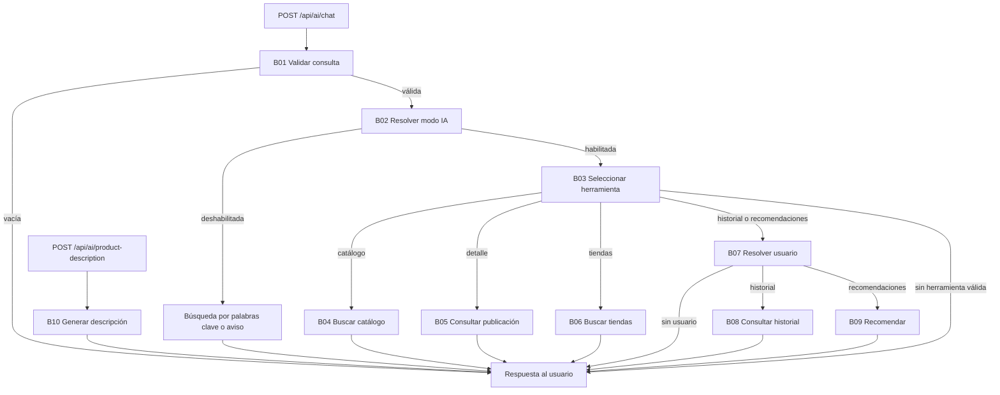

# Identificación de nodos a partir del código

Revisión estática: 04/09/2026. La carpeta existente es `backend/umss-market-api`.

Este documento y [nodos.py](../poc/nodos.py) reemplazan la identificación preliminar del flujo QR por una descomposición de los flujos de IA presentes en el código. Los nombres Python son etiquetas académicas: la implementación original está en Java/Spring y JavaScript/Node.js. No se introdujo una nueva arquitectura ni se conectaron ambos programas mediante un grafo.

## Alcance

Se inspeccionaron los controladores y el servicio de IA del backend, sus cinco casos de uso de consulta y el adaptador Ollama; en testing, los puntos de entrada básico/enhanced, agentes, generación, ejecución y análisis. La tabla descompone métodos grandes en responsabilidades; no afirma que cada nodo sea una clase, microservicio o función independiente.

El backend también expone autenticación, usuarios, tiendas, publicaciones, interacciones y administración de embeddings. Son capacidades de soporte y otros flujos REST; esta identificación se concentra en los flujos de IA comparables al ejemplo de la tarea. En los controladores revisados no aparecen endpoints de pedidos, pago QR o webhook bancario. No corresponde presentarlos como nodos implementados de este backend.

## Nodos del backend

| ID | Nodo académico | Entrada → salida | Código original |
|---|---|---|---|
| B01 | `validar_consulta` | mensaje → mensaje normalizado o respuesta por consulta vacía | [AIServiceImpl.java](../backend/umss-market-api/src/main/java/bo/umss/market/umss_market_api/application/services/AIServiceImpl.java), `chat` |
| B02 | `resolver_modo_ia` | mensaje y bandera iaEnabled → búsqueda KEYWORD, aviso de IA deshabilitada o selección de herramienta | [AIServiceImpl.java](../backend/umss-market-api/src/main/java/bo/umss/market/umss_market_api/application/services/AIServiceImpl.java), `chat` |
| B03 | `seleccionar_herramienta` | consulta → ToolDecision | [OllamaAdapter.java](../backend/umss-market-api/src/main/java/bo/umss/market/umss_market_api/infrastructure/adapters/OllamaAdapter.java), `selectTool` |
| B04 | `buscar_catalogo` | consulta y límite de resultados → lista de publicaciones | [SearchCatalogUseCase.java](../backend/umss-market-api/src/main/java/bo/umss/market/umss_market_api/application/usecases/SearchCatalogUseCase.java), `executeSemanticSearch` |
| B05 | `consultar_detalle_publicacion` | UUID o consulta de publicación → respuesta sobre la publicación | [GetPublicationDetailSemanticUseCase.java](../backend/umss-market-api/src/main/java/bo/umss/market/umss_market_api/application/usecases/GetPublicationDetailSemanticUseCase.java), `executeWithContext` |
| B06 | `buscar_tiendas` | consulta → respuesta de tiendas relevantes | [SearchStoresBySemanticUseCase.java](../backend/umss-market-api/src/main/java/bo/umss/market/umss_market_api/application/usecases/SearchStoresBySemanticUseCase.java), `executeSemanticSearch` |
| B07 | `resolver_usuario_autenticado` | SecurityContext de Spring → UUID o solicitud de inicio de sesión | [AIServiceImpl.java](../backend/umss-market-api/src/main/java/bo/umss/market/umss_market_api/application/services/AIServiceImpl.java), `getCurrentUserId` |
| B08 | `consultar_historial` | UUID autenticado y pregunta → respuesta basada en interacciones | [GetUserInteractionsSemanticUseCase.java](../backend/umss-market-api/src/main/java/bo/umss/market/umss_market_api/application/usecases/GetUserInteractionsSemanticUseCase.java), `executeUserHistory` |
| B09 | `generar_recomendaciones` | UUID autenticado y consulta → recomendaciones con contexto | [GetRecommendationsUseCase.java](../backend/umss-market-api/src/main/java/bo/umss/market/umss_market_api/application/usecases/GetRecommendationsUseCase.java), `getRecommendations` |
| B10 | `generar_descripcion_producto` | nombre, categoría y precio → ProductDescriptionResponse | [AIController.java](../backend/umss-market-api/src/main/java/bo/umss/market/umss_market_api/infrastructure/controllers/AIController.java), `generateProductDescription` |



Los controles de disponibilidad de los casos de uso también pueden terminar con un aviso. Catálogo devuelve un listado formateado por Java; las otras cuatro herramientas preparan contexto y pueden generar texto con el proveedor. Por eso no se dibuja un nodo LLM obligatorio después de todas las ramas.

## Nodos de la plataforma de pruebas

Se toma como referencia el menú `src/index.enhanced.js` y sus imports reales. `npm start` usa `src/index.js`; `npm run start:enhanced` usa el menú enhanced. Ambos existen y tienen diferencias.

| ID | Nodo académico | Entrada → salida | Código original |
|---|---|---|---|
| T01 | `seleccionar_flujo_pruebas` | opción del menú → ejecución Postman, Playwright o ambas | [index.enhanced.js](../ai-testing-agent/src/index.enhanced.js), `executePipeline` |
| T02 | `descubrir_coleccion` | workspaces y colecciones Postman → colección UMSS seleccionada y guardada | [postman.agent.enhanced.js](../ai-testing-agent/src/agents/postman.agent.enhanced.js), `execute` |
| T03 | `descubrir_datos_prueba` | datos disponibles en la API y autenticación → contexto de prueba | [dataDiscovery.service.js](../ai-testing-agent/src/services/dataDiscovery.service.js), `discover` |
| T04 | `ejecutar_newman` | ruta de colección y testData → resultado de requests y assertions | [runCollection.skill.js](../ai-testing-agent/src/skills/runCollection.skill.js), `execute` |
| T05 | `analizar_resultados_newman` | resultado Newman → análisis y reporte JSON | [analyzeResults.skill.js](../ai-testing-agent/src/skills/analyzeResults.skill.js), `execute` |
| T06 | `validar_salida_analisis` | análisis y número real de fallos → análisis corregido | [analyzeResults.skill.js](../ai-testing-agent/src/skills/analyzeResults.skill.js), `execute` |
| T07 | `preparar_features` | lista de features → features elegidas para generación | [playwright.agent.enhanced.js](../ai-testing-agent/src/agents/playwright.agent.enhanced.js), `execute` |
| T08 | `generar_pruebas_playwright` | feature → ruta del archivo .spec.js | [PlaywrightGenerator.js](../ai-testing-agent/src/generators/PlaywrightGenerator.js), `generate` |
| T09 | `ejecutar_playwright` | rutas de specs generados → resultados normalizados | [PlaywrightRunner.js](../ai-testing-agent/src/runners/PlaywrightRunner.js), `run` |
| T10 | `clasificar_fallos_playwright` | results.tests y métricas → fallos, severidades y recomendaciones | [ResultAnalyzer.js](../ai-testing-agent/src/analyzers/ResultAnalyzer.js), `analyze` |
| T11 | `generar_reportes_playwright` | resultados y análisis → reportes HTML, Markdown y consola | [playwright.agent.enhanced.js](../ai-testing-agent/src/agents/playwright.agent.enhanced.js), `execute` |

```text
Menú enhanced (T01)
  Postman:    T02 → T03 → T04 → T05 → T06 → reporte JSON
  Playwright: T07 → T08 → T09 → T10 → T11
  Completo:   Postman y después Playwright
```

T05 y T06 son bloques del mismo método: el fallback y el control de salida forman parte de `AnalyzeResultsSkill.execute`. T08 se repite por feature y requiere al menos un spec generado. Los errores de generación individuales se registran y permiten intentar las otras features.

## Diferencias con la imagen del docente

| Elemento del ejemplo | Evidencia en este proyecto |
|---|---|
| Guardrail de entrada | Validación básica de mensaje vacío en chat; validación de contexto de prueba y features en testing. No equivale a protección integral contra entradas maliciosas. |
| Clasificar | `OllamaAdapter.selectTool` selecciona una de las herramientas del chatbot. |
| Consultar caché semántica | No se identificó ese nodo en los flujos inspeccionados. Embeddings y búsqueda semántica no implican caché de respuestas. |
| Recuperar | Casos de uso de catálogo, detalle, tiendas, historial y recomendaciones. |
| Responder/fallback | Respuestas del backend según la rama; en Newman hay fallback explícito del análisis LLM. |
| Guardrail de salida | Newman corrige STABLE si existen fallos. No se identificó una etapa equivalente de validación de respuestas del chatbot. |
| Escalar a humano | No se identificó un flujo implementado de derivación humana. Registrar errores o recomendar revisar logs no realiza esa derivación. |

## Observaciones que afectan la exposición

- El nombre MCP aparece en el menú, pero la ruta Postman inspeccionada usa `postman.service.js` con Axios para consultar la API. El nombre por sí solo no demuestra transporte Model Context Protocol.
- El generador Playwright importa `AI.service.js`, que delega actualmente en `OllamaService`. El analizador que realmente importa el agente es `ResultAnalyzer.js`, no `ResultAnalyzer.enhanced.js`; clasifica y recomienda mediante reglas, sin llamada LLM.
- Las features predeterminadas del agente Playwright describen pruebas REST. El menú enhanced envía otra lista (login, búsqueda y pedido); por tanto, no se puede afirmar que todas las entradas ejecuten las mismas pruebas ni que la prueba declarada de pedido demuestre un endpoint implementado.
- Hay diferencias de contrato en el resumen del pipeline: Postman devuelve métricas en `newman`, mientras `executePipeline` busca en `testResults`, `results` o la raíz. Además, el agente Playwright devuelve `success: false` ante error, pero el pipeline comprueba `agentCompleted === false`. Estas diferencias pueden ocultar fallos o mostrar ceros; no se corrigieron como parte de esta identificación.

## Verificación y límites

Se verificó la trazabilidad a archivos y nombres de métodos mediante lectura estática. No se ejecutaron Newman ni pruebas generadas contra la API. El Python es una representación para lectura y exposición; sus funciones fallan explícitamente para evitar simular ejecución del sistema. La prueba asociada verifica ese contrato cuando haya Python disponible. No se afirma cobertura ni validación de integración del backend por esta revisión.
