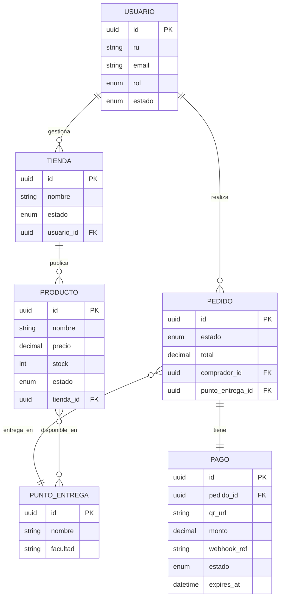

# Lightweight FSD (LFSD) — UMSS Market

> **Documento vivo** — se actualiza Sprint a Sprint. Versión mínima orientada a acción inmediata.
> Para la especificación completa ver [FSD_v1.md](../FSD_v1.md).

---

## 0. Metadatos ⚡

| Campo | Valor |
|-------|-------|
| Producto | UMSS Market |
| Grupo | — |
| Versión | v1.0 |
| Fecha | 11/05/2026 |
| Autores | Rodriguez Gonzales Abad Melani, Vargas Sandoval Christian Bernardo |
| Revisores | Docente + 1 grupo par |
| Estado | Borrador activo |
| **Modo elegido** | **LFSD ⚡** |
| Trazabilidad a PRD | PRD v1.0 |
| Insumos M2 (UI/UX) | `informe_heuristica_ecommerce.docx`, `entrevistas_usuarios.docx` |
| Fase Spec Kit cubierta | Specify ✅ / Plan ✅ / Tasks ✅ / Implement ⬜ |
| Sprint actual | Sprint 1 |

---

## 1. Resumen ejecutivo ⚡

UMSS Market formaliza el comercio universitario de la UMSS: marketplace multi-tenant con validación de identidad por RU, pagos QR dinámicos y stock sincronizado en tiempo real. Elimina el caos de WhatsApp, la validación manual de comprobantes y el quiebre de stock que afectan hoy a más de 80,000 usuarios potenciales. Meta clave: reducir el tiempo de compra de 3:40 min a menos de 60 segundos con tasa de pagos exitosos > 98%.

---

## 2. Alcance ⚡

### 2.1 Dentro del alcance (Sprint 1–3)

| Sprint | Funcionalidades |
|--------|----------------|
| **S1** | Registro/login con RU (SIIS), gestión básica de tienda y producto, stock inicial |
| **S2** | Carrito, generación QR dinámico, Webhook bancario, confirmación atómica de pedido |
| **S3** | Dashboard vendedor, notificaciones push, historial de transacciones, panel admin |

### 2.2 Fuera del alcance

- Delivery externo al campus, tarjetas internacionales, marketplace público fuera UMSS, IA avanzada, devoluciones/reembolsos.

### 2.3 Supuestos clave

- Estudiantes con smartphone + app bancaria compatible QR boliviano.
- SIIS UMSS expone endpoint de consulta de RU activo.
- API bancaria disponible con Webhook para confirmación de pago.

### 2.4 Plan técnico ⚡

| Bloque | Decisión |
|--------|----------|
| Stack | FastAPI (Python 3.12) + React 18 PWA + PostgreSQL 16 + Redis 7 |
| Arquitectura | Capas: API → Casos de uso → Dominio → Infraestructura |
| Estructura | `backend/` · `frontend/` · `infra/` · `docs/` |
| Decisiones clave | JWT + RU; Webhook asíncrono + HMAC; bloqueo optimista de stock en Redis |
| Restricciones | Multi-tenant, mobile-first, BD relacional obligatoria |

### 2.5 Tasks activas ⚡

| Task | Descripción | UC | Sprint | Estado |
|------|-------------|-----|--------|--------|
| T-001 | Modelo de BD (Usuario, Tienda, Producto, Pedido, Pago, PuntoEntrega) | — | S1 | ⬜ pendiente |
| T-002 | `POST /auth/register` — validación RU en SIIS | UC-003 | S1 | ⬜ pendiente |
| T-003 | `POST /auth/login` — JWT con roles | UC-003 | S1 | ⬜ pendiente |
| T-004 | CRUD Productos + stock | UC-002 | S1 | ⬜ pendiente |
| T-005 | `POST /pedidos` — bloqueo temporal stock Redis | UC-001 | S2 | ⬜ pendiente |
| T-006 | Generación QR dinámico (API bancaria) | UC-001 | S2 | ⬜ pendiente |
| T-007 | `POST /pagos/webhook` — confirmación atómica | UC-001 | S2 | ⬜ pendiente |
| T-008 | Notificaciones push por cambio de estado | UC-001/002 | S3 | ⬜ pendiente |
| T-009 | Dashboard vendedor + historial | UC-002 | S3 | ⬜ pendiente |
| T-010 | Panel admin UMSS | UC-003 | S3 | ⬜ pendiente |

---

## 3. Actores y roles ⚡

| Actor | Tipo | Rol |
|-------|------|-----|
| Comprador Estudiante | humano | Busca, paga, recibe |
| Emprendedor Estudiante | humano | Publica productos, gestiona stock y pedidos |
| Administrador UMSS | humano | Aprueba tiendas, audita transacciones |
| API Bancaria (QR) | sistema externo | Genera QR y notifica pago vía Webhook |
| SIIS UMSS | sistema externo | Valida RU activo |
| Servicio Notificaciones | sistema | Emite alertas push |

---

## 4. Casos de uso críticos ⚡

### UC-001 — Compra con Pago QR Dinámico
**Trazabilidad:** PRD-PAY-01 · BR-001/002/003 · MRD-N-02  
**Actor:** Comprador Estudiante

**Flujo principal:**
1. Comprador confirma carrito → sistema valida stock y crea pedido `PENDIENTE`.
2. Sistema solicita QR dinámico a API bancaria (monto exacto, expira en 5 min).
3. Comprador escanea QR y autoriza pago en app bancaria.
4. API bancaria envía Webhook → sistema valida HMAC, descuenta stock (atómico), pedido → `PAGADO`.
5. Sistema notifica al comprador (confirmación) y al vendedor (nuevo pedido) con punto de encuentro.

**Criterios Gherkin mínimos:**
```gherkin
Dado   un carrito válido con stock disponible y sesión activa
Cuando el comprador escanea el QR y paga el monto exacto
Entonces el pedido pasa a PAGADO, el stock se decrementa y ambos actores reciben notificación

Dado   que el QR no es pagado en 5 minutos
Cuando expira el tiempo
Entonces el pedido pasa a CANCELADO y el stock bloqueado se libera

Dado   un Webhook duplicado (mismo webhook_ref)
Cuando llega el segundo evento
Entonces se descarta por idempotencia sin reprocesar el pago
```

---

### UC-002 — Publicación de Producto
**Trazabilidad:** PRD-STK-01 · BR-003/007 · MRD-N-03  
**Actor:** Emprendedor Estudiante

**Flujo principal:**
1. Emprendedor completa formulario: nombre, precio (> 0), stock (≥ 1), imágenes, puntos de entrega.
2. Sistema valida inline (RF-05): precio > 0, stock ≥ 1, al menos un punto de entrega seleccionado.
3. Sistema guarda producto en estado `ACTIVO` y lo publica en el catálogo.

**Criterios Gherkin mínimos:**
```gherkin
Dado   una tienda ACTIVA y formulario completo con stock ≥ 1
Cuando el emprendedor presiona Publicar
Entonces el producto aparece en el catálogo con el stock y puntos de entrega correctos

Dado   que el emprendedor ingresa stock_inicial = 0
Cuando intenta publicar
Entonces el sistema muestra "El stock inicial debe ser al menos 1" y bloquea la publicación
```

---

### UC-003 — Registro y Validación de Emprendedor
**Trazabilidad:** BR-001/005 · MRD-N-01 · PRD RF-05  
**Actor:** Emprendedor Estudiante

**Flujo principal:**
1. Emprendedor ingresa RU + correo institucional → sistema consulta SIIS en tiempo real.
2. Sistema verifica dominio institucional (`@umss.edu.bo`) y unicidad de RU/email.
3. Emprendedor completa datos de tienda → sistema crea cuenta `PENDIENTE` + tienda `PENDIENTE_APROBACION`.
4. Sistema notifica al Administrador → Admin aprueba/rechaza → sistema notifica al emprendedor.

**Criterios Gherkin mínimos:**
```gherkin
Dado   un RU activo en SIIS y correo institucional válido
Cuando el emprendedor completa el formulario y envía la solicitud
Entonces la cuenta queda en PENDIENTE y el admin recibe notificación de revisión

Dado   un RU inexistente en SIIS
Cuando intenta registrarse
Entonces el sistema muestra "RU no reconocido" y bloquea el registro sin crear cuenta
```

---

## 5. Reglas de negocio ⚡

| ID | Regla | UC afectados |
|----|-------|-------------|
| BR-001 | Pedido requiere pago verificado por banco para aparecer en dashboard del vendedor | UC-001 |
| BR-002 | QR dinámico contiene monto exacto del pedido; no editable manualmente | UC-001 |
| BR-003 | Un QR solo paga un pedido; Webhook duplicado se descarta (idempotencia) | UC-001 |
| BR-004 | Stock se descuenta SOLO tras confirmación del Webhook bancario (atomicidad) | UC-001 |
| BR-005 | Solo usuarios con RU activo en SIIS pueden registrarse | UC-003 |
| BR-006 | QR expira a los 5 min sin pago; stock bloqueado se libera automáticamente | UC-001 |
| BR-007 | Stock inicial al publicar ≥ 1 | UC-002 |
| BR-008 | Puntos de encuentro son predefinidos; el comprador no ingresa texto libre de dirección | UC-001/002 |

---

## 6. Modelo de datos funcional ⚡



**Entidades clave:**

| Entidad | Atributos críticos | Validaciones |
|---------|-------------------|--------------|
| USUARIO | `ru` (único), `email` (dominio UMSS), `rol` (COMPRADOR/EMPRENDEDOR/ADMIN) | RU validado en SIIS; email regex RFC 5322 |
| PRODUCTO | `precio` (> 0), `stock` (≥ 0; al crear ≥ 1) | Estado: ACTIVO/AGOTADO/INACTIVO |
| PEDIDO | `estado` (PENDIENTE/PAGADO/CANCELADO/ENTREGADO), `total` = Σ(cant × precio) | Atómico con PAGO |
| PAGO | `webhook_ref` (único, índice), `expires_at` = created_at + 5 min | HMAC-SHA256 validado en Webhook |

---

## 7. Prompts-contrato ⚡

### PC-001 — UC-001 Compra QR

```markdown
# Role: Motor de pedidos UMSS Market
# Task: Orquestar creación de pedido → QR → Webhook → confirmación atómica
# Context: items[], punto_entrega_id, comprador_id | Reglas: BR-001..004,006
# Reasoning:
  1. Validar stock (Redis lock optimista)
  2. Crear PEDIDO PENDIENTE + PAGO con expires_at
  3. Solicitar QR a API bancaria → retornar qr_url
  4. Al Webhook: validar HMAC + unicidad webhook_ref → TX: descontar stock + PAGADO
  5. Publicar evento notificaciones
# Stop: STOCK_INSUFICIENTE | QR_GENERATION_FAILED | webhook_ref duplicado (200 idempotente) | race condition → revertir + alerta reembolso
# Output: { pedido_id, estado, qr_url, expires_at, punto_entrega }
# Invariants: total QR == total pedido | stock ≥ 0 | webhook_ref único
```

### PC-002 — UC-002 Publicar Producto

```markdown
# Role: Módulo de catálogo UMSS Market
# Task: Validar y persistir producto con stock y puntos de entrega
# Context: tienda_id, nombre, precio, stock_inicial, puntos_entrega_ids[] | Reglas: BR-003,007,008
# Reasoning:
  1. Verificar JWT rol=EMPRENDEDOR y tienda ACTIVA pertenece al actor
  2. Validar precio > 0, stock ≥ 1, ≥ 1 punto de entrega activo
  3. Persistir PRODUCTO ACTIVO + PRODUCTO_PUNTO
# Stop: STOCK_INVALIDO | PRECIO_INVALIDO | PUNTO_ENTREGA_INVALIDO | ACCESO_DENEGADO
# Output: { producto_id, estado: ACTIVO, url_catalogo }
```

### PC-003 — UC-003 Registro Emprendedor

```markdown
# Role: Servicio de identidad y onboarding UMSS Market
# Task: Validar RU en SIIS, crear usuario + tienda en estado pendiente, notificar admin
# Context: ru, email, nombre, facultad, password, datos_tienda | Reglas: BR-005
# Reasoning:
  1. Consultar SIIS(ru) → estado ACTIVO
  2. Validar dominio email institucional + unicidad RU/email
  3. Hash password bcrypt (cost ≥ 12)
  4. Crear USUARIO PENDIENTE + TIENDA PENDIENTE_APROBACION
  5. Notificar ADMIN
# Stop: RU_NO_VALIDO | RU_DUPLICADO | EMAIL_INVALIDO | SIIS_UNAVAILABLE (no crear usuario parcial)
# Output: { usuario_id, tienda_id, estado_cuenta: PENDIENTE, mensaje }
# Invariants: nunca guardar contraseña en texto plano | no exponer datos SIIS al cliente
```

---

## 8. Integraciones externas ⚡

| Sistema | Operaciones | SLA | Auth |
|---------|------------|-----|------|
| API Bancaria QR | `POST /qr/generar` + Webhook entrante | 99.9% / p95 < 1.5 s | API Key + HMAC-SHA256 |
| SIIS UMSS | `GET /estudiantes/{ru}/estado` | 99.5% / p95 < 2 s | API Key institucional |
| Notificaciones Push | `POST /notifications/send` | 99% / p95 < 5 s | Service Account |

---

## 9. Interfaces de usuario (referencia) ⚡

| Pantalla | UC cubierto | Heurística M2 aplicada |
|----------|------------|------------------------|
| `/auth/registro` | UC-003 | H5: validación inline RU y email |
| `/auth/login` | UC-003 | H5: errores en tiempo real (RF-05) |
| `/catalogo` | UC-001 | H1: stock visible en tiempo real |
| `/carrito` | UC-001 | H3: botón "Volver" en cada paso (RF-04) |
| `/pedido/qr` | UC-001 | H1: loader + contador expiración (RF-02) |
| `/pedido/confirmacion` | UC-001 | H1: confirmación con punto de encuentro |
| `/dashboard/emprendedor/nuevo-producto` | UC-002 | H5: validación inline stock y precio |
| `/admin/solicitudes` | UC-003 | H1: estado de aprobaciones visible |

### 9.1 Trazabilidad con M2 (UI/UX) ⚡

| Wireframe / mockup M2 | Pantalla LFSD | UC | Estado |
|-----------------------|--------------|-----|--------|
| Login / Registro (H5 detectada en heurística) | `/auth/login`, `/auth/registro` | UC-003 | ✅ cubierto (RF-05) |
| Flujo carrito-pago (H1, H3 detectadas) | `/carrito`, `/pedido/qr` | UC-001 | ✅ cubierto (RF-02, RF-04) |
| Dashboard vendedor (H4 detectada) | `/dashboard/emprendedor` | UC-002 | ✅ cubierto (RF-06, contraste 4.5:1) |

---

## 10. Requerimientos No Funcionales ⚡

| ID | Categoría | Requisito | Umbral |
|----|-----------|-----------|--------|
| NFR-001 | Rendimiento | Validación de pago tras Webhook | < 3 s (p95) |
| NFR-002 | Disponibilidad | Uptime en periodos académicos | ≥ 99.5% |
| NFR-003 | Seguridad | Autenticación | JWT + RU verificado; bcrypt cost ≥ 12 |
| NFR-004 | Seguridad | Integridad Webhook | HMAC-SHA256 obligatorio |
| NFR-005 | Usabilidad | SUS flujo de compra | ≥ 80 puntos |
| NFR-006 | Rendimiento | Tiempo flujo completo de compra | < 60 s |
| NFR-007 | Observabilidad | Trazabilidad transacciones | 100% pedidos con traceId |

---

## 11. Trazabilidad MRD → PRD → LFSD ⚡

| MRD | PRD | UC (LFSD) | NFR | Test |
|-----|-----|-----------|-----|------|
| MRD-N-01 (identidad) | PRD RF-05 | UC-003 | NFR-003 | TC-01: registro RU válido |
| MRD-N-02 (QR automático) | PRD-PAY-01 / RF-01/02 | UC-001 | NFR-001, NFR-004 | TC-02: pago QR < 3 s |
| MRD-N-03 (puntos encuentro) | PRD-UX-01 / RF-04 | UC-001/002 | NFR-005/006 | TC-03: punto fijo seleccionable |
| — | PRD-STK-01 / RF-03 | UC-001/002 | NFR-007 | TC-04: stock atómico post-Webhook |

---

## 12. Log de cambios del LFSD

| Sprint | Fecha | Cambio |
|--------|-------|--------|
| S0 | 11/05/2026 | Versión inicial LFSD con 3 UCs críticos, modelo ER, prompts-contrato y trazabilidad |
