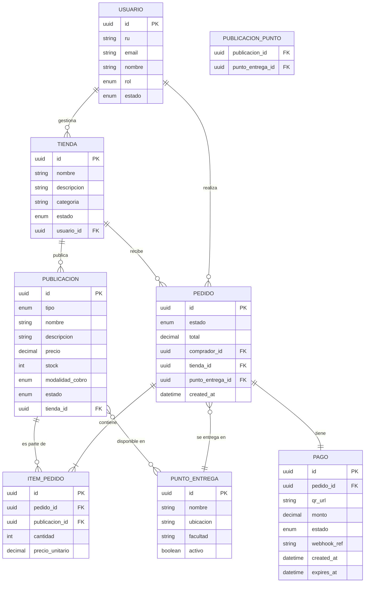
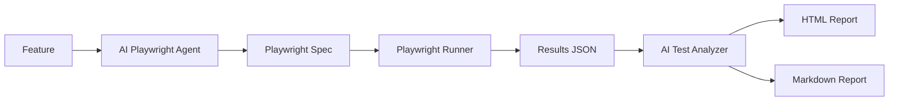

# Functional Specification Document (FSD) — UMSS Market

---

## 0. Metadatos ⚡🔧

| Campo | Valor |
|---|---|
| Producto | UMSS Market |
| Tipo de documento | Functional Specification Document (FSD) |
| Versión del documento | v4.0 |
| Fecha | 06/07/2026 |
| Autores | Rodriguez Gonzales Abad Melani, Vargas Sandoval Christian Bernardo |
| Revisores | Docente + revisión cruzada académica |
| Estado | Vigente |
| Enfoque documental | FSD clásico con integración AI-assisted |
| Trazabilidad principal |BRD v5 → PRD v4 → FSD v4 |
| Insumos UX/UI | `informe_heuristica_ecommerce.docx`, `entrevistas_usuarios.docx` |
| Capacidades cubiertas | Specify ✅ / Plan ✅ / Tasks ✅ / Validación Funcional ✅ / AI Testing ✅ / MCP Integration ✅ / Playwright Automation ✅ / AI Result Analysis ✅|
| Contratos IA relacionados | PR-FSD-001, PR-FSD-002, PR-FSD-003 |
| Arquitectura relacionada | Arquitectura desacoplada orientada a eventos y consistencia operacional |
| Objetivo del documento | Formalizar casos de uso, reglas operacionales, contratos funcionales IA y trazabilidad funcional del ecosistema UMSS Market |
Esta versión incorpora además las especificaciones funcionales de la plataforma AI Testing, incluyendo la integración mediante Model Context Protocol (MCP) con Postman, la generación automática de pruebas End-to-End mediante Playwright y el análisis inteligente de resultados utilizando modelos de lenguaje, fortaleciendo el proceso AI-SDLC del proyecto.
---

## 1. Resumen Ejecutivo ⚡🔧

UMSS Market es una plataforma de comercio electrónico multi-tenant diseñada exclusivamente para la comunidad de la Universidad Mayor de San Simón (UMSS). El sistema centraliza la oferta de productos de emprendedores estudiantiles, automatiza la validación de pagos mediante QR dinámico y actualización operacional de inventario, resolviendo la fragmentación e inseguridad del comercio informal actual basado en WhatsApp y redes sociales.

El sistema sirve a tres actores principales: emprendedores universitarios que necesitan gestionar pedidos sin intervención manual, estudiantes compradores que exigen rapidez y seguridad en sus transacciones, y administradores UMSS que supervisan la actividad comercial del campus. El diferencial estratégico radica en la integración con la identidad institucional (Registro Universitario), que elimina el anonimato y previene fraudes, y en la consistencia operacional entre pago, pedido y stock, que garantiza que un pedido confirmado siempre tenga respaldo real. El objetivo medible es reducir el tiempo de transacción de los actuales 3:40 min a menos de 60 segundos, con una tasa de éxito de pagos superior al 98%.

---

## 2. Alcance ⚡🔧

### 2.1 Dentro del alcance

- Registro y validación de emprendedores mediante Registro Universitario (RU).
- Gestión de tiendas multi-tenant.
- Gestión de publicaciones (Productos y Servicios).
- Administración de stock.
- Flujo completo de pedidos.
- Pago mediante QR dinámico.
- Validación automática mediante Webhook bancario.
- Dashboard del vendedor.
- Panel administrativo UMSS.
- Integración mediante MCP con Postman.
- Generación automática de pruebas End-to-End con Playwright.
- Ejecución automatizada de pruebas.
- Generación de reportes HTML y Markdown.
- Clasificación inteligente de errores mediante IA.
- Recomendaciones automáticas de mejora.
- Plataforma AI Testing integrada al ciclo AI-SDLC.

---

### 2.2 Fuera del alcance

- Delivery externo.
- Pagos internacionales.
- Marketplace abierto al público.
- Recomendaciones inteligentes para clientes.
- Corrección automática del código.
- Despliegue automático a Producción.
- Auto-remediación sin intervención humana.

---

### 2.3 Supuestos y dependencias

**Supuestos**

- API Bancaria disponible.
- SIIS operativo.
- Infraestructura Cloud disponible.
- Conectividad estable.
- Acceso a un proveedor LLM (OpenAI o Mock AI Service)
- Acceso a Postman API.
- Node.js instalado.
- Playwright instalado.

**Dependencias**

- API Bancaria
- SIIS
- OpenAI
- Postman
- Playwright
- Newman
- GitHub
- Docker

---

### 2.4 Plan técnico (Spec Kit)

| Bloque | Contenido |
|----------|-----------|
| Arquitectura | Clean Architecture + Hexagonal |
| Backend | Node.js |
| Testing | Playwright + Newman |
| IA | AI Provider (OpenAI / Mock AI) |
| Integración | Model Context Protocol (MCP) |
| Reportes | HTML + Markdown |
| Automatización | AI Testing Agent |
| Versionamiento | Git + GitHub |
| Documentación | BRD, PRD, FSD, ADR |

---

### 2.5 Descomposición en Tasks (Spec Kit)

| Task | Descripción | Estado |
|-------|-------------|---------|
| T-001 | Registro usuarios | ✅ |
| T-002 | Login | ✅ |
| T-003 | Refresh Token | ✅ |
| T-004 | CRUD Publicaciones | ✅ |
| T-005 | Crear Pedido | ✅ |
| T-006 | Generar QR | ✅ |
| T-007 | Webhook Banco | ✅ |
| T-008 | Notificaciones | ✅ |
| T-009 | Dashboard | ✅ |
| T-010 | Administración | ✅ |
| T-011 | Marketplace | ✅ |
| T-012 | Carrito | ✅ |
| T-013 | MCP Postman Agent | 🆕 |
| T-014 | AI Playwright Generator | 🆕 |
| T-015 | Playwright Runner | 🆕 |
| T-016 | AI Test Analyzer | 🆕 |
| T-017 | HTML Report Generator | 🆕 |
| T-018 | Markdown Report Generator | 🆕 |
### 2.6 Relación entre Features
Los tres nuevos Features implementados forman una plataforma integrada de AI Testing.

El flujo completo es el siguiente:

1. MCP Postman Agent descubre automáticamente las APIs y ejecuta pruebas funcionales.

2. AI Playwright Testing Agent genera pruebas End-to-End utilizando Inteligencia Artificial.

3. AI Test Analyzer procesa los resultados de ejecución, clasifica errores y genera reportes técnicos.

Cada Feature puede ejecutarse de manera independiente, pero juntos implementan un pipeline completo de automatización de pruebas alineado con el enfoque AI-SDLC.
---
## 3. Actores y roles del sistema ⚡🔧

| Actor | Descripción | Responsabilidades |
|--------|-------------|-------------------|
| Cliente | Usuario que compra productos o servicios | Buscar publicaciones, realizar pedidos y efectuar pagos mediante QR |
| Emprendedor | Propietario de una tienda | Administrar publicaciones, inventario, pedidos y ventas |
| Administrador UMSS | Responsable institucional | Supervisar el funcionamiento general del Marketplace |
| Banco | Sistema externo | Validar pagos mediante Webhook |
| QA Engineer | Responsable del aseguramiento de calidad | Ejecutar pruebas funcionales, validar resultados y aprobar versiones |
| AI Testing Agent | Agente inteligente | Coordinar la generación, ejecución y análisis automático de pruebas |
| MCP Postman Agent | Agente especializado | Descubrir Workspaces, Collections y ejecutar pruebas API mediante MCP |
| AI Playwright Agent | Agente especializado | Generar automáticamente pruebas End-to-End utilizando IA |
| AI Test Analyzer | Agente especializado | Analizar resultados, clasificar errores y generar recomendaciones técnicas |
---
## 4. Casos de Uso ⚡🔧

### UC-001 - Gestionar Publicaciones

**Actor Principal**

Emprendedor

**Descripción**

Permite crear, editar, eliminar y consultar productos y servicios del Marketplace.

**Precondiciones**

- Usuario autenticado.
- Tienda registrada.

**Postcondiciones**

- Publicación almacenada correctamente.

---

### UC-002 - Procesar Pedido

**Actor Principal**

Cliente

**Descripción**

Permite registrar un pedido y generar un pago mediante QR.

**Precondiciones**

- Publicación disponible.
- Stock suficiente.

**Postcondiciones**

- Pedido registrado.

---

### UC-003 - Validar Pago

**Actor Principal**

Banco

**Descripción**

El banco envía el Webhook y el Marketplace confirma el pago.

**Precondiciones**

- QR generado.

**Postcondiciones**

- Pedido pagado.

---

## UC-004 - Ejecutar pruebas API mediante MCP Postman Agent

**Actor Principal**

QA Engineer

**Actor Secundario**

MCP Postman Agent

**Descripción**

El agente obtiene automáticamente los Workspaces, descubre las Collections y ejecuta las pruebas API mediante Newman.

**Precondiciones**

- API Key configurada.
- Workspace disponible.
- Collections existentes.

**Postcondiciones**

- Resultados JSON generados.

---

## UC-005 - Generar pruebas End-to-End mediante AI Playwright Agent

**Actor Principal**

QA Engineer

**Actor Secundario**

AI Playwright Agent

**Descripción**

El agente interpreta la especificación funcional y genera automáticamente pruebas Playwright listas para ejecutarse.

**Precondiciones**

- Feature documentada.
- Prompt disponible.

**Postcondiciones**

- Archivo *.spec.js generado.

### Artefactos generados

- `generated-tests/login.spec.js`
- `reports/playwright-results.json`
- `reports/report.html`
- `reports/ai-report.md`

### Componentes involucrados

- AIService
- PlaywrightGenerator
- SpecWriter
- PlaywrightRunner
### Flujo funcional

1. Leer Feature.
2. Interpretar criterios de aceptación.
3. Generar escenarios.
4. Construir código Playwright.
5. Validar sintaxis.
6. Guardar archivo.
7. Devolver ubicación del archivo generado.

---

## UC-006 - Analizar resultados mediante AI Test Analyzer

**Actor Principal**

Desarrollador

**Actor Secundario**

AI Test Analyzer

**Descripción**

El agente procesa los resultados de ejecución, identifica errores, determina su severidad y propone recomendaciones técnicas.

**Precondiciones**

- Ejecución finalizada.
- Reporte JSON disponible.

**Postcondiciones**

- Reporte HTML generado.
- Reporte Markdown generado.
- Resumen ejecutivo generado.

### Entradas

- Archivo JSON generado por Playwright.
- Logs de ejecución.
- Resultados de Newman.
- Resultados de Playwright.

### Salidas

- Reporte HTML.
- Reporte Markdown.
- Resumen Ejecutivo.
- Clasificación de severidad.
- Recomendaciones técnicas.

### Componentes involucrados

- ResultAnalyzer
- HtmlReporter
- MarkdownReporter
- ConsoleReporter
### Flujo funcional

1. Leer resultados JSON.
2. Detectar pruebas fallidas.
3. Clasificar severidad.
4. Buscar causa probable.
5. Generar recomendaciones.
6. Crear reporte HTML.
7. Crear reporte Markdown.
---
## 5. Reglas de Negocio ⚡🔧

| ID | Regla de Negocio | Prioridad |
|----|------------------|-----------|
| BR-001 | Todo usuario deberá autenticarse mediante JWT antes de acceder a funcionalidades protegidas. | Alta |
| BR-002 | Solo el propietario podrá administrar su tienda. | Alta |
| BR-003 | No se podrá vender un producto sin stock disponible. | Alta |
| BR-004 | El pago deberá validarse mediante Webhook bancario antes de confirmar un pedido. | Alta |
| BR-005 | Toda publicación deberá pertenecer a una tienda registrada. | Alta |
| BR-006 | Los pedidos deberán registrar su historial de estados. | Media |
| BR-007 | Toda notificación deberá quedar registrada para auditoría. | Media |
| BR-008 | El Dashboard mostrará únicamente información del propietario autenticado. | Media |
| BR-009 | Las colecciones Postman deberán ejecutarse mediante el MCP Postman Agent. | Alta |
| BR-010 | Las pruebas End-to-End deberán generarse automáticamente utilizando IA. | Alta |
| BR-011 | Todo resultado de ejecución deberá ser analizado automáticamente antes de generar el reporte final. | Alta |
| BR-012 | Todo reporte deberá generarse en formato HTML y Markdown. | Media |
| BR-013 | La clasificación de errores utilizará niveles Critical, High, Medium y Low. | Media |
| BR-014 | Ningún resultado generado por IA reemplazará la validación humana. | Alta |
---
## 6. Modelo de datos funcional ⚡🔧

### 6.1 Diagrama ER (Mermaid)




### 6.2 Diccionario de datos

| Entidad | Atributo | Tipo | Obligatorio | Validaciones | Origen |
|---------|----------|------|-------------|--------------|--------|
| USUARIO | `id` | UUID v4 | sí | formato UUIDv4 | sistema |
| USUARIO | `ru` | string(10) | sí | único, validado contra SIIS | usuario |
| USUARIO | `email` | string(120) | sí | regex RFC 5322, dominio `@umss.edu.bo` | usuario |
| USUARIO | `rol` | enum | sí | `COMPRADOR`, `EMPRENDEDOR`, `ADMIN` | sistema |
| USUARIO | `estado` | enum | sí | `PENDIENTE`, `ACTIVO`, `SUSPENDIDO` | sistema |
| TIENDA | `id` | UUID v4 | sí | — | sistema |
| TIENDA | `estado` | enum | sí | `PENDIENTE_APROBACION`, `ACTIVA`, `SUSPENDIDA` | sistema |
| PUBLICACION | `id` | UUID v4 | sí | formato UUIDv4 | sistema |
| PUBLICACION | `nombre` | string(120) | sí | longitud 3-120 | emprendedor |
| PUBLICACION | `descripcion` | string(1000) | sí | longitud máxima 1000 | emprendedor |
| PUBLICACION | `tienda_id` | UUID v4 | sí | debe existir en TIENDA | sistema |
| PUBLICACION | `precio` | decimal(10,2) | sí | > 0 | emprendedor |
| PUBLICACION | `stock` | integer | sí | ≥ 0; al crear ≥ 1 (BR-007) | emprendedor / sistema |
| PUBLICACION | `estado` | enum | sí | `ACTIVO`, `AGOTADO`, `INACTIVO` | sistema |
| PUBLICACION | tipo | enum | sí | PRODUCTO, SERVICIO | emprendedor |
| PUBLICACION | modalidad_cobro | enum | no* | PRECIO_FIJO, POR_HORA, POR_SESION | emprendedor |
| PEDIDO | `estado` | enum | sí | `PENDIENTE`, `PAGADO`, `CANCELADO`, `ENTREGADO` | sistema |
| PEDIDO | `total` | decimal(10,2) | sí | = suma(cantidad × precio_unitario) | sistema |
| PAGO | `qr_url` | string(500) | sí | URL HTTPS del QR generado por banco | API bancaria |
| PAGO | `webhook_ref` | string(100) | sí | único, índice en BD para idempotencia (BR-003) | API bancaria |
| PAGO | `expires_at` | datetime | sí | `created_at + 5 minutos` (BR-006) | sistema |
| PAGO | `estado` | enum | sí | `GENERADO`, `CONFIRMADO`, `EXPIRADO`, `FALLIDO` | sistema |
| PUNTO_ENTREGA | `ubicacion` | string(200) | sí | texto libre solo por Admin | admin |

---
### 6.3 Artefactos generados por AI Testing
| Artefacto | Generado por | Descripción |
|-----------|--------------|-------------|
| login.spec.js | AI Playwright Agent | Caso de prueba generado automáticamente |
| playwright-results.json | Playwright Runner | Resultado de ejecución |
| ai-report.md | AI Test Analyzer | Resumen generado por IA |
| report.html | HTML Reporter | Reporte ejecutivo |
| console-report | Console Reporter | Resumen mostrado en consola |
---
## 7. Prompt como Contrato Funcional ⚡🔧

### 7.1 Prompt-contrato para FSD-UC-001 (Proceso de Compra con Pago QR)

```markdown
# Role
Eres el motor de procesamiento de pedidos de UMSS Market, responsable de orquestar el
flujo completo desde la creación del pedido hasta la confirmación de pago QR dinámico.

# Task
Dado un carrito validado con `comprador_id`, `items[]` y `punto_entrega_id`, debes:
1. Crear el pedido con estado PENDIENTE.
2. Solicitar a la API bancaria la generación del QR dinámico con el monto exacto.
3. Bloquear temporalmente el stock en Redis por 5 minutos.
4. Al recibir el Webhook bancario, validar firma, monto y unicidad, luego descontar
   stock de forma atómica y confirmar el pedido.
5. Emitir notificaciones push al comprador y al vendedor.

# Context
- Entrada: `{ comprador_id: UUID, items: [{publicacion_id: UUID, cantidad: int}],
  punto_entrega_id: UUID }`
- Reglas aplicables: BR-001, BR-002, BR-003, BR-004, BR-006
- Restricciones: el monto del QR es inmutable; el Webhook debe validarse con firma HMAC
  antes de procesar; el descuento de stock ocurre SOLO tras confirmación bancaria.

# Reasoning
Pasos obligatorios:
1. Validar stock disponible de cada ítem (consulta BD + control operacional de concurrencia).
2. Calcular total = suma(precio_unitario × cantidad).
3. Crear registro PEDIDO en estado PENDIENTE y registro PAGO con expires_at = now + 5 min.
4. Llamar a la API bancaria con monto y referencia del pedido para obtener qr_url.
5. Retornar qr_url al cliente.
6. Al recibir Webhook: verificar HMAC, verificar webhook_ref no existe en tabla PAGO,
   verificar monto coincide con PAGO.monto.
7. Iniciar transacción DB: descontar stock, actualizar PAGO a CONFIRMADO, actualizar
   PEDIDO a PAGADO.
8. Publicar evento a cola de notificaciones.

# Stop condition
Detente si:
- Stock insuficiente en el paso 1 → retornar error `STOCK_INSUFICIENTE`.
- API bancaria no responde en < 3 s → retornar error `QR_GENERATION_FAILED`.
- Webhook con webhook_ref duplicado → retornar HTTP 200 (idempotencia, no reprocesar).
- Stock agotado en paso 7 (conflicto concurrente) → revertir transacción, marcar PAGO como
  FALLIDO, emitir alerta de reembolso.

# Output
Formato: JSON
Ejemplo de respuesta al crear pedido:
```

```json
{
  "pedido_id": "uuid-v4",
  "estado": "PENDIENTE",
  "total": 30.00,
  "qr_url": "https://banco.bo/qr/abc123",
  "expires_at": "2026-05-11T15:35:00Z",
  "punto_entrega": { "nombre": "Puerta Facultad de Tecnología", "ubicacion": "…" }
}
```

**Invariants**: El campo `total` del QR debe ser igual al `total` del pedido. El `webhook_ref` debe ser único en la tabla PAGO. El stock nunca debe ser negativo.

**Failure modes**:
- `STOCK_INSUFICIENTE` (HTTP 409): uno o más ítems sin stock.
- `QR_GENERATION_FAILED` (HTTP 502): API bancaria no disponible.
- `PAGO_EXPIRADO` (HTTP 410): QR expirado, pedido cancelado.
- `RACE_CONDITION_STOCK` (HTTP 409): stock agotado durante confirmación.

---

### 7.2 Prompt-contrato para FSD-UC-002 (Publicación y Gestión de Productos y Servicios)

```markdown
# Role
Eres el módulo de gestión de publicaciones de UMSS Market. Recibes solicitudes de
emprendedores validados para crear y administrar publicaciones de tipo PRODUCTO
o SERVICIO dentro de una tienda activa.

# Task
Dado un payload de creación de publicación, debes validar las reglas de negocio,
persistir la publicación y asociarla a los puntos de entrega seleccionados,
dejándola visible en el catálogo público del marketplace.

# Context
- Entrada:
{
  tienda_id: UUID,
  tipo: "PRODUCTO" | "SERVICIO",
  nombre: string,
  descripcion: string,
  precio: decimal,
  stock_inicial?: int,
  modalidad_cobro?: "PRECIO_FIJO" | "POR_HORA" | "POR_SESION",
  imagenes: string[],
  puntos_entrega_ids: UUID[]
}

- Reglas aplicables:
  - BR-007: stock mínimo para productos.
  - BR-008: puntos de encuentro predefinidos.
  - BR-009: la tienda debe estar activa.
  - BR-010: los servicios requieren modalidad de cobro.
  - BR-011: solo los productos utilizan control de stock.

- El actor debe tener rol EMPRENDEDOR y la tienda debe estar en estado ACTIVA.

# Reasoning
1. Verificar que el JWT del request pertenece a un usuario con rol EMPRENDEDOR.
2. Verificar que la tienda existe, pertenece al emprendedor y está en estado ACTIVA.
3. Validar nombre, descripción y precio.
4. Validar que existe al menos un punto de entrega seleccionado.
5. Verificar que todos los puntos_entrega_ids existen y están activos.
6. Si tipo = PRODUCTO:
   - validar stock_inicial ≥ 1.
   - registrar stock inicial.
7. Si tipo = SERVICIO:
   - validar modalidad_cobro obligatoria.
   - no registrar stock.
8. Persistir PUBLICACION con estado ACTIVO.
9. Persistir registros en PUBLICACION_PUNTO.
10. Retornar la publicación creada con su URL pública.

# Stop condition
Detente si:

- tipo inválido → error TIPO_PUBLICACION_INVALIDO.
- precio ≤ 0 → error PRECIO_INVALIDO.
- tipo = PRODUCTO y stock_inicial < 1 → error STOCK_INVALIDO.
- tipo = SERVICIO y modalidad_cobro ausente → error MODALIDAD_COBRO_REQUERIDA.
- puntos_entrega_ids vacío o inválido → error PUNTO_ENTREGA_INVALIDO.
- tienda no activa o no pertenece al emprendedor → error ACCESO_DENEGADO.

# Output
Formato: JSON
```

```json
{
  "publicacion_id": "uuid-v4",
  "tipo": "PRODUCTO",
  "estado": "ACTIVO",
  "nombre": "Empanada de queso",
  "precio": 5.00,
  "stock": 10,
  "url_catalogo": "/catalogo/publicaciones/uuid-v4"
}
```

**Invariants**:

* El precio siempre debe ser mayor a cero.
* Solo las publicaciones tipo PRODUCTO utilizan stock.
* Toda publicación visible debe pertenecer a una tienda ACTIVA.
* Toda publicación tipo SERVICIO debe tener modalidad_cobro definida.
* Ninguna publicación puede crearse sin al menos un punto de entrega válido.

**Failure modes**:

* `TIPO_PUBLICACION_INVALIDO` (HTTP 422): tipo no reconocido.
* `PRECIO_INVALIDO` (HTTP 422): precio ≤ 0.
* `STOCK_INVALIDO` (HTTP 422): stock_inicial < 1 para PRODUCTO.
* `MODALIDAD_COBRO_REQUERIDA` (HTTP 422): servicio sin modalidad de cobro.
* `PUNTO_ENTREGA_INVALIDO` (HTTP 422): punto de entrega inexistente o inactivo.
* `ACCESO_DENEGADO` (HTTP 403): tienda no pertenece al emprendedor o no está activa.

```
```
---
### 7.3 Prompt-contrato para FSD-UC-003 (Registro de Emprendedor)

```markdown
# Role
Eres el servicio de identidad y onboarding de UMSS Market. Validas que los nuevos
usuarios son miembros activos de la comunidad UMSS y creas sus cuentas con el rol
y estado correspondiente.

# Task
Dado un payload de registro de emprendedor, validar el RU contra SIIS, verificar la
unicidad del correo, crear el usuario y la tienda en estado PENDIENTE_APROBACION,
y notificar al administrador para aprobación.

# Context
- Entrada: `{ ru: string, email: string, nombre_completo: string, facultad: string,
  password: string, nombre_tienda: string, descripcion_tienda: string, categoria: string }`
- Reglas: BR-005 (solo RU UMSS), correo dominio institucional.
- Dependencia: API SIIS UMSS para validación de RU.

# Reasoning
1. Consultar SIIS con el RU proporcionado; verificar estado = ACTIVO.
2. Validar que el email tiene dominio institucional UMSS.
3. Verificar unicidad de RU y email en la tabla USUARIO.
4. Hashear la contraseña con bcrypt (cost ≥ 10).
5. Crear USUARIO con estado PENDIENTE y rol EMPRENDEDOR.
6. Crear TIENDA asociada con estado PENDIENTE_APROBACION.
7. Emitir notificación al ADMIN con datos de la solicitud.

# Stop condition
Detente si:
- SIIS no encuentra el RU → error `RU_NO_VALIDO`.
- RU ya registrado → error `RU_DUPLICADO`.
- Email no institucional → error `EMAIL_INVALIDO`.
- SIIS no responde en < 5 s → error `SIIS_UNAVAILABLE` (no crear usuario parcial).

# Output
Formato: JSON
```

```json
{
  "usuario_id": "uuid-v4",
  "tienda_id": "uuid-v4",
  "estado_cuenta": "PENDIENTE",
  "estado_tienda": "PENDIENTE_APROBACION",
  "mensaje": "Solicitud recibida. El administrador revisará tu tienda en breve."
}
```

**Invariants**: Nunca crear usuario sin RU verificado. La contraseña nunca se almacena en texto plano. No exponer datos del SIIS en la respuesta al cliente.

**Failure modes**:
- `RU_NO_VALIDO` (HTTP 422): RU no encontrado o inactivo en SIIS.
- `RU_DUPLICADO` (HTTP 409): RU ya registrado en el sistema.
- `EMAIL_INVALIDO` (HTTP 422): dominio no institucional.
- `SIIS_UNAVAILABLE` (HTTP 503): API SIIS no disponible.

---

### 7.4 Métricas de prompt-contract *(opcional)*

| Métrica | Definición operativa | Umbral sugerido | Cómo se mide |
|---------|----------------------|-----------------|---------------|
| **Prompt coverage** | % de casos de uso críticos con prompt-contrato vivo y testeado | ≥ 80 % | revisión por pares + grep en `docs/PROMPT_MAPPING.md` |
| **Spec fidelity** | % de outputs del agente que respetan los Invariants y Failure modes declarados en §7 | ≥ 90 % | suite de tests contra prompt-contrato + revisión humana |

---
### 7.5 Prompt-contrato para FSD-UC-004 (MCP Postman Agent)

#### Objetivo

Automatizar el descubrimiento de Workspaces y Collections de Postman mediante Model Context Protocol (MCP), ejecutar las colecciones seleccionadas utilizando Newman y generar un reporte estructurado de la ejecución.

---

#### Role

Senior QA Automation Engineer especializado en automatización de pruebas API mediante Postman, Newman y Model Context Protocol.

---

#### Task

- Obtener automáticamente los Workspaces disponibles.
- Seleccionar el Workspace correspondiente al proyecto.
- Descubrir las Collections existentes.
- Ejecutar la Collection mediante Newman.
- Capturar resultados de ejecución.
- Generar métricas de éxito y fallo.
- Exportar resultados en formato JSON.

---

#### Context

Entradas:

- API Key de Postman.
- Workspace seleccionado.
- Collection seleccionada.
- Variables de entorno.

Herramientas utilizadas:

- MCP
- Postman API
- Newman
- Node.js

---

#### Reasoning

1. Validar credenciales.
2. Obtener lista de Workspaces.
3. Seleccionar Workspace objetivo.
4. Obtener Collections.
5. Ejecutar Collection.
6. Analizar resultado.
7. Generar reporte.

---

#### Stop Condition

El proceso finaliza cuando:

- Todas las solicitudes fueron ejecutadas.
- Newman devuelve el resumen final.
- Se genera el archivo JSON de resultados.

---

#### Output

- Reporte JSON.
- Métricas de ejecución.
- Número de pruebas.
- Número de fallos.
- Tiempo total.

---

#### Invariants

- No modificar Collections existentes.
- No alterar variables del Workspace.
- No eliminar Requests.
- Mantener compatibilidad con Newman.

---

#### Failure Modes

- API Key inválida.
- Workspace inexistente.
- Collection inexistente.
- Timeout.
- Error de red.
- Newman no disponible.

---

### 7.6 Prompt-contrato para FSD-UC-005 (AI Playwright Testing Agent)

#### Objetivo

Generar automáticamente casos de prueba End-to-End utilizando Inteligencia Artificial a partir de las especificaciones funcionales del sistema.

---

#### Role

Senior QA Automation Engineer especializado en Playwright, Testing Automation y Prompt Engineering.

---

#### Task

- Interpretar la Feature.
- Analizar criterios de aceptación.
- Generar código Playwright.
- Aplicar buenas prácticas.
- Crear assertions.
- Guardar automáticamente el archivo .spec.js.

---

#### Context

Entradas:

- Feature.
- Descripción funcional.
- Historia de Usuario.
- Acceptance Criteria.

Herramientas:

- OpenAI API
- Node.js
- Playwright
- File System

---

#### Reasoning

1. Analizar Feature.
2. Identificar escenarios.
3. Construir flujo de navegación.
4. Crear assertions.
5. Generar código.
6. Guardar archivo.

---

#### Stop Condition

Finaliza cuando:

- Se genera un archivo .spec.js válido.
- El archivo puede ejecutarse mediante Playwright.

---

#### Output

- Archivo Playwright.
- Código JavaScript.
- Casos de prueba.
- Assertions.

---

#### Invariants

- Utilizar Playwright Test.
- Generar únicamente JavaScript válido.
- No utilizar Markdown.
- No incluir explicaciones.
- Utilizar expect().
- Mantener código limpio.

---

#### Failure Modes

- Feature incompleta.
- Acceptance Criteria insuficientes.
- Error OpenAI.
- Error de escritura del archivo.

---

### 7.7 Prompt-contrato para FSD-UC-006 (AI Test Analyzer)

#### Objetivo

Analizar automáticamente los resultados de ejecución de Playwright utilizando Inteligencia Artificial para identificar errores, determinar su severidad y generar recomendaciones técnicas.

---

#### Role

Senior QA Automation Engineer especializado en análisis de resultados, automatización y aseguramiento de calidad.

---

#### Task

- Leer resultados JSON.
- Identificar pruebas fallidas.
- Clasificar severidad.
- Detectar causa probable.
- Generar recomendaciones.
- Elaborar resumen ejecutivo.
- Crear reportes HTML y Markdown.

---

#### Context

Entradas:

- JSON Playwright.
- Resultados de ejecución.
- Logs.
- Errores detectados.

Herramientas:

- OpenAI API.
- Playwright.
- HTML Reporter.
- Markdown Reporter.

---

#### Reasoning

1. Leer resultados.
2. Identificar errores.
3. Clasificar severidad.
4. Buscar causa probable.
5. Generar recomendaciones.
6. Crear resumen ejecutivo.
7. Generar reportes.

---

#### Stop Condition

El proceso finaliza cuando:

- Todos los resultados fueron analizados.
- Se clasificaron los errores.
- Se generó el reporte HTML.
- Se generó el reporte Markdown.

---

#### Output

- Resumen Ejecutivo.
- Lista de errores.
- Clasificación de severidad.
- Recomendaciones.
- Reporte HTML.
- Reporte Markdown.

---

#### Invariants

- No modificar resultados originales.
- Analizar únicamente información disponible.
- No inventar errores.
- Mantener trazabilidad con la ejecución.

---

#### Failure Modes

- JSON inválido.
- Resultado incompleto.
- Error OpenAI.
- Error de lectura del archivo.
- Timeout durante el análisis.

---

## 7.8 Arquitectura Funcional AI Testing

## 8. Integraciones externas

| Sistema | Tipo | Protocolo | Operaciones | SLA esperado | Autenticación |
|---------|------|-----------|-------------|--------------|---------------|
| **API Bancaria QR** | síncrono REST (generación) + asíncrono Webhook (confirmación) | HTTPS | `POST /qr/generar`, `POST /pagos/webhook` (recibido) | 99.9% / p95 < 1.5 s | API Key + HMAC-SHA256 en Webhook |
| **SIIS UMSS** | síncrono REST | HTTPS | `GET /estudiantes/{ru}/estado` | 99.5% / p95 < 2 s | API Key institucional |
| **Servicio de Notificaciones Push** | asíncrono | HTTPS / FCM | `POST /notifications/send` | 99% / p95 < 5 s | Service Account Key |
| OpenAI API | REST | HTTPS | Generación de pruebas Playwright y análisis inteligente de resultados | 99.9% | API Key |
| Postman API | REST | HTTPS | Descubrimiento de Workspaces, Collections y ejecución mediante MCP | 99.9% | API Key |
| Playwright CLI | Local | CLI | Ejecución de pruebas End-to-End | Local | N/A |
| GitHub | REST | HTTPS | Versionamiento del proyecto | 99.9% | Token |
---
## 8.1 Componentes de la Plataforma AI Testing

La plataforma AI Testing está compuesta por tres agentes especializados que colaboran para automatizar el ciclo de pruebas.

| Componente | Responsabilidad |
|------------|-----------------|
| MCP Postman Agent | Descubrir Workspaces y Collections, ejecutar pruebas API mediante Newman |
| AI Playwright Testing Agent | Generar automáticamente pruebas End-to-End utilizando Inteligencia Artificial |
| AI Test Analyzer | Analizar resultados, clasificar errores y generar recomendaciones |
| HTML Reporter | Generar reportes ejecutivos en HTML |
| Markdown Reporter | Generar reportes técnicos en Markdown |
| Console Reporter | Mostrar resultados resumidos en consola |
| Playwright Runner | Ejecutar pruebas Playwright |
| Result Analyzer | Consolidar resultados antes del análisis IA |
| AIService | Abstracción del proveedor de IA |
| MockAIService | Generación simulada durante desarrollo |
| OpenAIService | Integración con OpenAI |
| SpecWriter | Persistencia de archivos .spec.js |
| PromptBuilder | Construcción dinámica de prompts para IA |
---

## 9. Interfaces de usuario (referencia) 

Basado en los insumos del Módulo 2 (UX/UI): `informe_heuristica_ecommerce.docx` y `entrevistas_usuarios.docx`.

| Pantalla | Caso de uso cubierto | Principio heurístico aplicado |
|----------|----------------------|-------------------------------|
| `/auth/registro` | FSD-UC-003 | H5: Prevención de errores (validación inline de RU y email) |
| `/auth/login` | FSD-UC-003 | H5: Validación en tiempo real (RF-05) |
| `/catalogo` | FSD-UC-001 | H1: Visibilidad del estado del sistema (estado actualizado de disponibilidad) |
| `/carrito` | FSD-UC-001 | H3: Libertad del usuario (botón "Volver" en cada paso, RF-04) |
| `/pedido/qr` | FSD-UC-001 | H1: Loader + contador de expiración (RF-02) |
| `/pedido/confirmacion` | FSD-UC-001 | H1: Confirmación clara con detalle del punto de encuentro |
| `/dashboard/emprendedor` | FSD-UC-002 | H4: Contraste mínimo 4.5:1 en botones de acción (RF-06) |
| `/dashboard/emprendedor/nueva-publicacion` | FSD-UC-002 | H5: Validación inline de stock y precio |
| `/admin/solicitudes` | FSD-UC-003 | H1: Vista de estado de aprobaciones |

### 9.1 Trazabilidad con M2 (UI/UX)

| Wireframe / mockup M2 | Pantalla FSD | Caso de uso (FSD-UC) | Estado de la traza |
|-----------------------|--------------|----------------------|---------------------|
| Pantalla de login (heurística H5 detectada) | `/auth/login` | FSD-UC-003 | ✅ cubierto (RF-05) |
| Flujo de carrito y pago (H1, H3 detectadas) | `/carrito`, `/pedido/qr` | FSD-UC-001 | ✅ cubierto (RF-02, RF-04) |
| Dashboard de vendedor (H4 detectada) | `/dashboard/emprendedor` | FSD-UC-002 | ✅ cubierto (RF-06) |

---

## 10. Requerimientos No Funcionales (NFR) ⚡🔧

| ID | Categoría | Requisito | Métrica | Umbral | Cómo se verifica |
|----|-----------|-----------|---------|--------|------------------|
| NFR-001 | Rendimiento | Validación de pago tras recibir Webhook bancario | latencia p95 | < 3 s | prueba de carga k6 sobre endpoint Webhook |
| NFR-002 | Disponibilidad | Plataforma durante periodos académicos | uptime mensual | ≥ 99.5% | monitoreo (UptimeRobot o similar) |
| NFR-003 | Seguridad | Autenticación de usuarios | obligatorio | RU verificado + JWT firmado | auditoría de endpoints con Postman + revisión de código |
| NFR-004 | Seguridad | Integridad de Webhook bancario | obligatorio | HMAC-SHA256 validado en cada petición | revisión de código + test automatizado |
| NFR-005 | Seguridad | Contraseñas en reposo | obligatorio | bcrypt con cost ≥ 12 | auditoría de código |
| NFR-006 | Escalabilidad | Usuarios concurrentes en horas pico | throughput sostenido | ≥ 100 req/s sostenidos | prueba de stress k6 |
| NFR-007 | Usabilidad | Puntaje de usabilidad (SUS) del flujo de compra | SUS score | ≥ 80 puntos | evaluación con usuarios reales (n ≥ 5) |
| NFR-008 | Rendimiento | Tiempo total de flujo de compra (carrito a confirmación) | tiempo de usuario | < 60 s | medición en prueba de usuario |
| NFR-009 | Monitoreo y trazabilidad operacional | Trazabilidad de transacciones | % pedidos con identificador de trazabilidad | ≥ 95% | inspección de logs en producción |
| NFR-010 | Cumplimiento | Ley de Servicios Financieros de Bolivia | aplicable | según normativa | revisión legal antes del despliegue |
| NFR-011 | Calidad   | Cobertura Playwright | Cobertura | ≥90%   | Reporte Playwright |
| NFR-012 | Rendimiento | Generación automática de pruebas IA | Tiempo | <20 s | Medición automática |
| NFR-013 | Rendimiento | Análisis inteligente de resultados | Tiempo | <10 s | Medición automática |
| NFR-014 | Disponibilidad | Integración Postman API | Disponibilidad | ≥99% | Monitoreo |
| NFR-015 | Calidad | Generación de reportes HTML y Markdown | Cobertura | 100% | Validación funcional |
---

## 11. Trazabilidad MRD → PRD → FSD ⚡🔧

| MRD (necesidad) | PRD (requerimiento) | FSD (caso de uso) | NFR | Prueba de aceptación |
|-----------------|---------------------|-------------------|-----|----------------------|
| MRD-N-01 (identidad validada) | PRD RF-05 (validación inline) | FSD-UC-003 (Registro de Emprendedor) | NFR-003 | TC-01: Registro con RU válido → cuenta creada |
| MRD-N-02 (QR automático) | PRD-PAY-01 / RF-01 / RF-02 | FSD-UC-001 (Proceso de Compra) | NFR-001, NFR-004 | TC-02: Pago QR → confirmación < 3 s |
| MRD-N-03 (puntos de encuentro) | PRD-UX-01 / PRD RF-04 | FSD-UC-001, FSD-UC-002 | NFR-007, NFR-008 | TC-03: Punto de entrega fijo seleccionable |
| — | PRD-STK-01 / RF-03 | FSD-UC-001, FSD-UC-002 | NFR-009 | TC-04: Stock se descuenta solo tras Webhook confirmado |
| — | PRD US-02 (bloqueo stock) | FSD-UC-002 (Publicación) | NFR-006 | TC-05: Stock inválido bloquea publicación tipo PRODUCTO |
| BR-009 | PRD-REQ-009 | FSD-UC-004 | T-013 | TC-011 |
| BR-010 | PRD-REQ-010 | FSD-UC-005 | T-014, T-015 | TC-012, TC-013 |
| BR-011 | PRD-REQ-011 | FSD-UC-006 | T-016, T-017, T-018 | TC-014, TC-015 |
---

## 12. Plan de pruebas funcionales 🔧

| TC ID | Caso de uso | Descripción del test | Precondición | Resultado esperado |
|-------|-------------|----------------------|--------------|-------------------|
| TC-01 | FSD-UC-003 | Registro exitoso con RU activo en SIIS | RU activo, email institucional | Cuenta creada en estado PENDIENTE |
| TC-02 | FSD-UC-003 | Registro rechazado con RU inválido | RU no existente en SIIS | Error `RU_NO_VALIDO`, sin cuenta creada |
| TC-03 | FSD-UC-001 | Compra exitosa con QR pagado antes de expirar | Stock ≥ 1, API bancaria activa | Pedido PAGADO, stock decrementado, notificación enviada |
| TC-04 | FSD-UC-001 | QR expirado sin pago | Comprador no paga en 5 min | Pedido CANCELADO, stock liberado |
| TC-05 | FSD-UC-001 | conflicto concurrente: dos compradores, un ítem | Stock = 1, dos pedidos simultáneos | Solo uno PAGADO; segundo recibe error de stock |
| TC-06 | FSD-UC-001 | Webhook duplicado ignorado | Mismo `webhook_ref` enviado dos veces | Solo se procesa el primero; segundo retorna HTTP 200 sin reprocesar |
| TC-07 | FSD-UC-002 | Publicación exitosa con stock ≥ 1 | Tienda ACTIVA, datos válidos | Publicación visible en catálogo con stock correcto |
| TC-08 | FSD-UC-002 | Publicación rechazada con stock = 0 | Tienda ACTIVA, stock_inicial = 0 | Error `STOCK_INVALIDO`, publicación no creada |
| TC-09 | FSD-UC-001 | Flujo completo < 60 segundos | Condiciones normales de red | Tiempo usuario de carrito a confirmación < 60 s |
| TC-10 | FSD-UC-003 | Correo no institucional rechazado | Email con dominio @gmail.com | Error `EMAIL_INVALIDO`, sin cuenta creada |
| TC-011 | FSD-UC-004 | Descubrir Workspaces y ejecutar Collection mediante MCP | Workspace disponible | Reporte JSON generado |
| TC-012 | FSD-UC-005 | Generar automáticamente archivo Playwright | Feature documentada | Archivo .spec.js generado |
| TC-013 | FSD-UC-005 | Ejecutar prueba Playwright | Archivo .spec.js existente | Reporte JSON generado |
| TC-014 | FSD-UC-006 | Analizar resultados mediante IA | JSON Playwright disponible | Errores clasificados correctamente |
| TC-015 | FSD-UC-006 | Generar reportes HTML y Markdown | Resultados analizados | Reportes generados correctamente |
---
## 13. Riesgos funcionales

| Riesgo | Probabilidad | Impacto | Mitigación |
|---|---|---|---|
| Caída temporal de la API bancaria QR | Media | Alto | Reintentos controlados y notificación clara al usuario |
| Expiración de QR antes de completar el pago | Alta | Medio | Regeneración rápida de QR y liberación automática de stock |
| Conflictos concurrentes de stock en alta demanda | Media | Alto | Control operacional de concurrencia y validación previa al pago |
| RU inválido o inconsistente en SIIS | Baja | Alto | Validación obligatoria contra SIIS antes del registro |
| Saturación del sistema en horarios pico universitarios | Media | Medio | Monitoreo operacional y optimización progresiva |
| Webhooks duplicados enviados por la API bancaria | Media | Medio | Validación de unicidad e idempotencia operacional |
| Cambios en la API de OpenAI | Media | Alto | Mantener versión estable del SDK |
| Cambios en Postman API | Baja | Medio | Versionado de integraciones |
| Generación incorrecta de pruebas IA | Media | Medio | Validación por QA antes de aprobar |
| Cambios en Playwright | Baja | Medio | Mantener versión estable del framework |
---
## 14. Glosario

| Término | Definición |
|---|---|
| RU | Registro Universitario utilizado para validar identidad dentro de la UMSS |
| SIIS | Sistema Institucional de Identidad utilizado para validar estudiantes activos |
| QR dinámico | Código QR generado específicamente para una transacción única y temporal |
| Webhook | Evento HTTP enviado automáticamente por un sistema externo para notificar cambios |
| Idempotencia | Capacidad de procesar múltiples veces una misma operación sin generar duplicados |
| Multi-tenant | Modelo donde múltiples tiendas operan dentro de una infraestructura compartida |
| PWA | Progressive Web Application optimizada para dispositivos móviles |
| JWT | JSON Web Token utilizado para autenticación y autorización |
| Consistencia operacional | Garantía funcional de coherencia entre pedidos, pagos y stock |
| AI-assisted | Uso de capacidades asistidas por inteligencia artificial dentro del flujo AI-SDLC |
| FSD | Functional Specification Document |
| PRD | Product Requirements Document |
| BRD | Business Requirements Document |
| NFR | Non-Functional Requirement |
| MCP | Model Context Protocol para comunicación con herramientas externas |
| Newman | CLI oficial de Postman para ejecutar Collections |
| Playwright | Framework de automatización End-to-End |
| LLM | Large Language Model |
| AI Testing Agent | Plataforma inteligente que automatiza la generación, ejecución y análisis de pruebas de software |
---

## 15. Registro de cambios

| Versión | Fecha | Autor | Cambio |
|---------|-------|-------|--------|
| v1.0 | 11/05/2026 | Rodriguez / Vargas | Versión inicial del FSD clásico con 3 casos de uso críticos, modelo ER, prompts-contrato y trazabilidad completa MRD → PRD → FSD |
| v2.0 | 24/05/2026 | Rodriguez / Vargas | Refinamiento funcional, alineación AI-assisted y consolidación operacional del sistema |
| v3.0 | 21/06/2026 | Rodriguez / Vargas | Evolución del marketplace para soportar productos y servicios mediante la entidad PUBLICACION, incorporación de modalidades de cobro para servicios, actualización de UC-002, modelo de datos, reglas de negocio y trazabilidad documental. |
| v4.0 | 06/07/2026 | Rodriguez Gonzales Abad Melani / Vargas Sandoval Christian Bernardo | Incorporación de la AI Testing Platform, integración MCP Postman Agent, AI Playwright Testing Agent, AI Test Analyzer, nuevos casos de uso, Prompt Contracts, integraciones, NFR, trazabilidad, plan de pruebas e integración con Mock AI para desarrollo offline. |