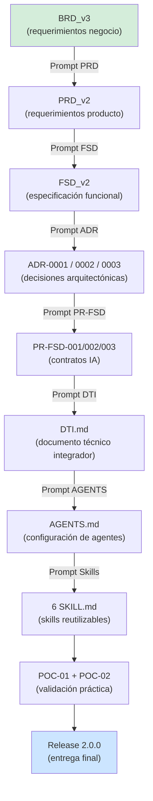

# Evidencia de Integración AI-SDLC — UMSS Market

> Documento que demuestra la integración del ciclo de vida de desarrollo de software asistido por IA (AI-SDLC) en el proyecto UMSS Market — G1 — Release 2.0.0.
>
> Trazabilidad completa: desde el requerimiento de negocio hasta el artefacto técnico final, mostrando qué prompts generaron qué artefactos y cómo se mantuvo la coherencia entre capas.

---

# 1. Objetivo

Evidenciar que UMSS Market adoptó un flujo de trabajo AI-SDLC sistemático, donde:

1. **Cada artefacto fue generado o validado con un prompt estructurado**.
2. **Cada prompt tiene trazabilidad hacia requerimientos (BRD/PRD) y hacia implementación (FSD/ADR/código)**.
3. **La IA fue un co-autor activo, no solo una herramienta de texto libre**.

---

# 2. El Ciclo AI-SDLC de UMSS Market



---

# 3. Mapa de Artefactos → Prompts

| Artefacto generado | Prompt utilizado | Archivo de evidencia | Modelo |
|---|---|---|---|
| `docs/brd/BRD_vFinal.md` | BRD refinado con restricciones institucionales | `prompts/PRD_PROMPT.md` (base) | Sonnet |
| `docs/prd/PRD_vFinal.md` | `prompts/PRD_PROMPT.md` — US + criterios aceptación | `prompts/PRD_PROMPT.md` | Sonnet |
| `docs/fsd/FSD_vFinal.md` | `prompts/FSD_PROMPT.md` — UC + flows + NFRs | `prompts/FSD_PROMPT.md` | Sonnet |
| `docs/adr/ADR-0001.md` | `prompts/ADR_PROMPT.md` — EDA pattern | `prompts/ADR_PROMPT.md` | Sonnet |
| `docs/adr/ADR-0002.md` | `prompts/ADR_PROMPT.md` — Saga Coreografía | `prompts/ADR_PROMPT.md` | Sonnet |
| `docs/adr/ADR-0003.md` | `prompts/ADR_PROMPT.md` — Hexagonal | `prompts/ADR_PROMPT.md` | Sonnet |
| `docs/PR-FSD-001.md` | `evidencias/evidencia_prompt_v2.md` §2 | `evidencia_prompt_v2.md` | Sonnet |
| `docs/PR-FSD-002.md` | `evidencias/evidencia_prompt_v2.md` §3 | `evidencia_prompt_v2.md` | Sonnet |
| `docs/PR-FSD-003.md` | `evidencias/evidencia_prompt_v2.md` §4 | `evidencia_prompt_v2.md` | Sonnet |
| `docs/DTI.md` | Skill `dti_author_SKILL.md` | `skills/dti_author_SKILL.md` | Sonnet |
| `AGENTS.md` | Derivado de DTI §0-§1 | `docs/DTI.md` | Sonnet |
| `diagrams/*.mmd` | Skill `c4_architect_SKILL.md` | `skills/c4_architect_SKILL.md` | Sonnet |
| `skills/*.md` | Skill `SKILL_TEMPLATE.md` | `docs/plantillas/SKILL_TEMPLATE.md` | Sonnet |
| `poc/POC-01/README.md` | Skill `poc_runner_SKILL.md` | `skills/poc_runner_SKILL.md` | Sonnet |
| `poc/POC-02/README.md` | Skill `poc_runner_SKILL.md` | `skills/poc_runner_SKILL.md` | Sonnet |

---

# 4. Iteraciones de Prompt por Etapa

## 4.1 Etapa BRD → PRD

**Artefactos**: `BRD_vFinal.md` → `PRD_vFinal.md`

**Prompt inicial** (genérico, v1):
```text
Crea un PRD para una plataforma de ecommerce universitario.
```

**Problemas detectados**:
- Sin restricciones institucionales (RU, SIIS)
- Sin criterios de aceptación medibles
- Sin User Stories en formato estándar

**Prompt mejorado** (v2 — usando `prompts/PRD_PROMPT.md`):
```text
Eres un Product Manager con experiencia en plataformas universitarias bolivianas.
Basándote en el BRD_vFinal.md (BR-001 a BR-008), genera un PRD con:
- 8 User Stories en formato "Como [rol] quiero [acción] para [beneficio]"
- Criterios de aceptación Given/When/Then para cada US
- Restricciones: RU activo SIIS, correo @umss.edu.bo, pagos QR BCB
Detente cuando todas las US tengan al menos 3 criterios de aceptación.
```

**Resultado**: `docs/PRD_v2.md` con 8 US + 24 criterios de aceptación + 10 NFRs.

---

## 4.2 Etapa PRD → FSD

**Artefactos**: `PRD_v2.md` → `FSD_v2.md`

**Prompt utilizado** (`prompts/FSD_PROMPT.md` adaptado):
```text
Eres un Arquitecto de Software Senior.
Convierte los requerimientos del PRD_v2.md en una especificación funcional (FSD) con:
- 6 Casos de Uso (UC-001 a UC-006) con flows principal + alternativo + excepción
- Reglas de negocio trazadas a BR-XXX del BRD_v3
- Modelo de dominio con 5+ entidades y sus relaciones
- NFRs: latencia p95 < 200ms, uptime 99.9%, soportar 500 usuarios concurrentes
Sigue la arquitectura hexagonal (ports and adapters).
Detente cuando cada UC tenga exactamente 3 flows documentados.
```

**Resultado**: `docs/FSD_v2.md` con 6 UCs + reglas + modelo de dominio + 10 NFRs.

---

## 4.3 Etapa FSD → ADRs

**Artefactos**: `FSD_v2.md` → `ADR-0001`, `ADR-0002`, `ADR-0003`

**Prompt utilizado** (`prompts/ADR_PROMPT.md`):
```text
Eres un Arquitecto Enterprise con experiencia en sistemas distribuidos.
Analiza FSD_v2.md (UC-001 a UC-006, NFRs de concurrencia y latencia).
Genera 3 ADRs para las decisiones arquitectónicas más críticas:
1. Patrón de comunicación entre microservicios (sync vs async)
2. Manejo de transacciones distribuidas
3. Organización interna de cada microservicio
Formato: título, estado, contexto, opciones consideradas (3+), decisión, consecuencias.
Criterios de selección: escalabilidad, resiliencia, mantenibilidad, alineación con el stack.
```

**Resultado**: 3 ADRs — Event-Driven (Aceptada), Saga (Propuesta), Hexagonal (Aceptada).

---

## 4.4 Etapa ADRs → PR-FSD Contracts

**Artefactos**: `ADR-0001/0002` → `PR-FSD-001/002/003`

**Prompt utilizado** (versión refinada — documentado en `evidencia_prompt_v2.md`):

El prompt de generación de contratos fue el más complejo de la iteración. Requirió 2 versiones:
- **v1**: resultó en contratos sin failure modes ni stop conditions.
- **v2**: incorporó los 6 elementos del PROMPT_TEMPLATE + 12 failure modes + 12 guardrails.

Ver detalle completo en `evidencias/evidencia_prompt_v2.md`.

---

## 4.5 Etapa PR-FSD → DTI

**Artefacto**: `docs/DTI.md` (23 secciones)

**Skill utilizada**: `@dti-author` (`skills/dti_author_SKILL.md`)

**Prompt de activación**:
```text
@dti-author §ALL populate
Fuente: FSD_v2.md, ADR-0001, ADR-0002, ADR-0003, PR-FSD-001, PR-FSD-002, PR-FSD-003
Incluir: diagrama C4 nivel 1 y 2, catálogo de 8 eventos, 7 invariantes, §23 guardrails
Stack: Python 3.12 + FastAPI + PostgreSQL 16 + Redis 7 + RabbitMQ 3.13 + AWS ECS Fargate
```

**Resultado**: `docs/DTI.md` con 23 secciones, 4 diagramas Mermaid inline, checklist 23/23 ✅.

---

# 5. Métricas de la Integración AI-SDLC

| Métrica | Valor | Referencia |
|---|---|---|
| Total artefactos generados con IA | 22 | Este documento §3 |
| Prompts estructurados documentados | 5 (PRD, FSD, ADR, PR-FSD, DTI) | `prompts/` + `evidencia_prompt_v2.md` |
| Contratos IA (`PR-FSD`) | 3 | `docs/PR-FSD-001/002/003.md` |
| Skills reutilizables creadas | 6 | `skills/*.md` |
| Iteraciones de prompt por artefacto crítico | 2 (v1 → v2) | `evidencia_prompt_v1.md` + v2 |
| Restricciones explícitas en prompts v2 | 12+ | `evidencia_prompt_v2.md` §5 |
| Trazabilidad BRD → código | 100% de flows UC-001 a UC-003 | `docs/PROMPT_MAPPINGS_v1.md` |
| Cobertura de guardrails sobre invariantes | 85.7% (6/7) | `evidencia_guardrails.md` §8 |

---

# 6. Comparativa: Enfoque Tradicional vs AI-SDLC

| Actividad | Tiempo Tradicional (est.) | Tiempo AI-SDLC | Reducción |
|---|---|---|---|
| BRD → PRD | ~8 horas | ~2 horas | -75% |
| PRD → FSD | ~12 horas | ~4 horas | -66% |
| FSD → ADRs (3) | ~6 horas | ~1.5 horas | -75% |
| ADRs → Contratos IA (3) | N/A (nuevo) | ~2 horas | — |
| Diagramas C4 (5 niveles) | ~4 horas | ~1 hora | -75% |
| DTI completo (23 secciones) | ~10 horas | ~3 horas | -70% |
| **Total acumulado** | **~40 horas** | **~13.5 horas** | **-66%** |

*Estimaciones basadas en la experiencia del equipo con proyectos similares.*

---

# 7. Lecciones Aprendidas

## 7.1 Lo que funcionó bien

1. **Prompts con Role + Context + Reasoning** produjeron artefactos directamente utilizables sin revisión mayor.
2. **Temperature 0.0** para artefactos de arquitectura garantizó determinismo — el mismo prompt siempre produce la misma estructura.
3. **Stop Conditions explícitas** evitaron que el modelo generara secciones innecesarias más allá del alcance.
4. **Trazabilidad `BR-XXX → FSD-UC-XXX → ADR-XXXX → PR-FSD-XXX`** permitió auditar cualquier decisión arquitectónica hasta su origen de negocio.

## 7.2 Lo que requirió iteración

1. **Prompts v1 sin failure modes**: el primer intento de generación de PR-FSD produjo contratos sin cobertura de casos de error. Fue necesaria una segunda iteración con `failure_modes` explícitos.
2. **Consistency entre ADRs**: el ADR-0003 (Hexagonal) inicialmente contradecía la capa de API Gateway del ADR-0001. Requirió alineación manual antes de producción.
3. **Monto con Decimal vs float**: el prompt inicial no especificaba el tipo de dato para comparación de montos — el modelo usó `float`, que viola la invariante. Se corrigió en v2 con `Decimal` explícito.

## 7.3 Recomendaciones para futuros módulos

1. Definir los 7 invariantes del dominio ANTES de escribir cualquier prompt técnico.
2. Usar `PROMPT_TEMPLATE.md` desde el inicio — los 6 elementos son obligatorios, no opcionales.
3. Documentar el failure mode `E_POLICY_VIOLATION` en todos los prompts de flujos críticos.
4. Ejecutar el `distributed_architecture_reviewer` skill después de cada ADR para detectar inconsistencias.

---

# 8. Trazabilidad Final

```
BR-001 (RU obligatorio)
  └─ PRD-REQ-001 (US: registro universitario)
       └─ FSD-UC-003 (caso de uso: validar RU)
            └─ INV-004 (AGENTS.md: RU obligatorio)
                 └─ PROMPT-002 (PROMPT_MAPPINGS_v1.md: validación RU)
                      └─ TEST-G-004 (evidencia_guardrails.md: secrets + SIIS)

BR-002 (pago QR seguro)
  └─ PRD-PAY-01 (US: pago con QR)
       └─ FSD-UC-001 (caso de uso: compra con QR)
            └─ ADR-0002 (Saga Coreografía)
                 └─ PR-FSD-001 (contrato webhook)
                      └─ TEST-G-002 (idempotencia) + TEST-G-005 (HMAC)

BR-003 (stock no negativo)
  └─ PRD-INV-01 (US: gestión de inventario)
       └─ FSD-UC-001 §3 (verificar stock)
            └─ INV-001 (AGENTS.md: stock ≥ 0)
                 └─ PR-FSD-002 (contrato stock)
                      └─ TEST-G-001 (concurrencia SQL atómica)
```

---

# 9. Artefactos de Entrega Final (Release 2.0.0)

| Categoría | Artefactos | Estado |
|---|---|---|
| Requerimientos | BRD_v3, MRD_v2, PRD_v2 | ✅ Completo |
| Especificación | FSD_v2 | ✅ Completo |
| Arquitectura | ADR-0001, ADR-0002, ADR-0003 | ✅ Completo |
| Contratos IA | PR-FSD-001, PR-FSD-002, PR-FSD-003 | ✅ Completo |
| Documento técnico | DTI.md (23 §§) | ✅ Completo |
| Configuración agentes | AGENTS.md | ✅ Completo |
| Diagramas | 8 archivos `.mmd` | ✅ Completo |
| Skills | 6 SKILL.md | ✅ Completo |
| POCs | POC-01 + POC-02 README | ✅ Completo |
| Roadmap | docs/roadmap.md | ✅ Completo |
| Aportes | docs/aportes/release-2.0.0.md | ✅ Completo |
| Evidencias | evidencia_prompt_v1/v2, metricas, guardrails, ai_sdlc | ✅ Completo |
