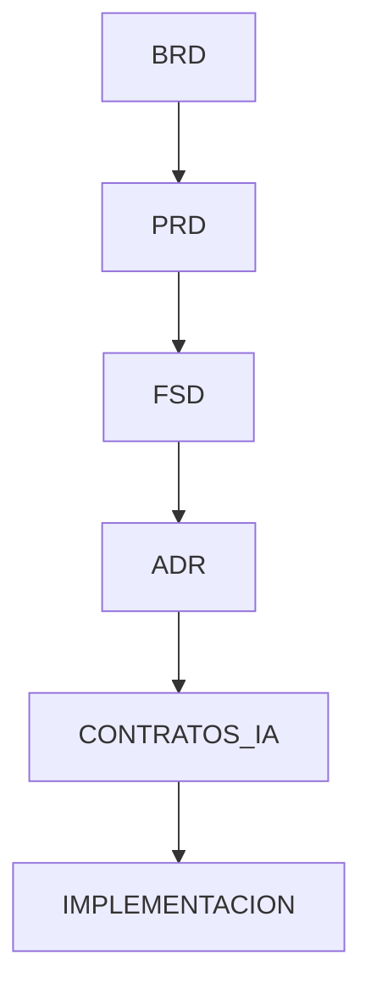

# evidencia_prompt_v1.md

# Evidencia de Prompt Engineering V1 — UMSS Market

---

# 1. Objetivo

Formalizar la evidencia del proceso de Prompt Engineering aplicado dentro del flujo AI-SDLC del proyecto UMSS Market.

El objetivo principal fue construir prompts estructurados capaces de generar artefactos técnicos consistentes, trazables y alineados con restricciones funcionales, arquitectónicas y operacionales del sistema.

La evidencia demuestra:

- Iteración progresiva de prompts
- Refinamiento técnico
- Integración AI-assisted
- Trazabilidad documental
- Aplicación de principios AI-SDLC

---

# 2. Contexto del Proyecto

UMSS Market es una plataforma marketplace multi-tenant orientada exclusivamente a la comunidad universitaria de la Universidad Mayor de San Simón (UMSS).

El sistema busca resolver problemas operacionales relacionados con:

- Validación manual de pagos QR
- Pérdida de pedidos
- Falta de control de stock
- Ausencia de trazabilidad operacional
- Gestión informal mediante WhatsApp e Instagram

El proyecto utiliza:

- Arquitectura orientada a eventos (EDA)
- Microservicios
- Integración bancaria QR
- Validación RU mediante SIIS
- Flujo AI-assisted basado en AI-SDLC

---

# 3. Objetivo del Prompt

El prompting fue utilizado para automatizar parcialmente la generación de artefactos técnicos asociados al ciclo AI-SDLC:

- PRD
- FSD
- ADRs
- Contratos IA
- Reglas operacionales
- Flujos Event-Driven

El propósito fue reducir ambigüedad, mejorar consistencia y acelerar documentación técnica.

---

# 4. Prompt Inicial Utilizado

```text
Actúa como un arquitecto de software senior especializado en sistemas distribuidos, arquitectura hexagonal y microservicios orientados a eventos.

Genera una propuesta de arquitectura para UMSS Market considerando:

- Frontend web
- Backend desacoplado
- Comunicación asíncrona
- API Gateway
- Eventos de dominio
- Escalabilidad horizontal
- Integración futura con IA
```

---

# 5. Problemas Detectados

| Problema | Impacto |
|---|---|
| Ambigüedad arquitectónica | Los bounded contexts no estaban claros |
| Generalización excesiva | La respuesta era demasiado abstracta |
| Falta de trazabilidad | No existía relación explícita con BRD/PRD |
| Ausencia de restricciones | El modelo proponía componentes fuera del alcance |
| Falta de consistencia operacional | No se contemplaban eventos duplicados ni idempotencia |

---

# 6. Refinamiento del Prompt

Se incorporaron mecanismos de control estructural:

- Reasoning Steps
- Stop Conditions
- Invariants
- Failure Modes
- Restricciones explícitas
- Output estructurado
- Trazabilidad documental

---

# 7. Prompt Refinado

```text
Actúa como arquitecto enterprise especializado en:

- DDD
- Event-Driven Architecture
- Clean Architecture
- Saga Pattern
- CQRS
```

---

# 8. Evidencia de Integración AI-SDLC



---

# 9. Conclusiones

El uso de Prompt Engineering estructurado permitió:

- Mejorar significativamente la calidad documental
- Reducir ambigüedad técnica
- Mantener trazabilidad entre artefactos
- Formalizar validaciones operacionales
- Integrar AI-assisted workflows dentro del ciclo AI-SDLC
- Generar artefactos alineados con arquitectura distribuida y Event-Driven

