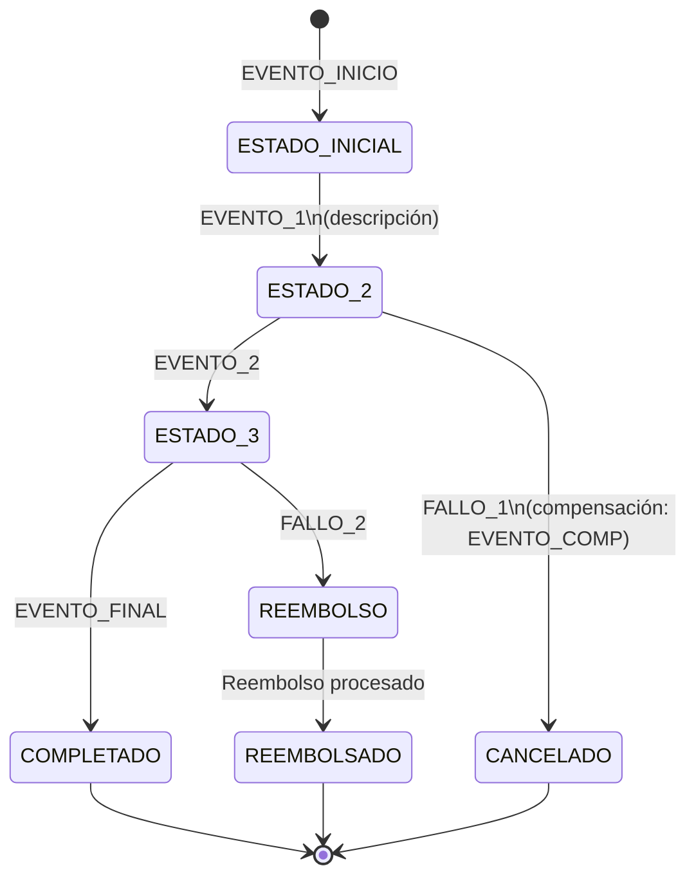

# Skill: saga-designer — Diseñar flujos Saga con compensaciones

> **Activación**: `@saga-designer nuevo <nombre-flujo>` o `@saga-designer actualizar <evento>`  
> Ejemplo: `@saga-designer nuevo flujo-devolución`, `@saga-designer actualizar STOCK_RELEASED`

## 1. Cuándo activarlo (triggers)

- DURANTE: diseño de un nuevo flujo distribuido, modificación de la Saga existente, o validación de que todas las compensaciones están cubiertas.
- ARRANCA cuando: el usuario invoca `"@saga-designer"` o solicita "diseñar el flujo de compensación para X" o "validar que la Saga tiene todos los rollbacks".
- NO ACTIVAR cuando: el flujo es sincrónico y punto a punto (no distribuido); usar la lógica de dominio directamente.

## 2. Entradas obligatorias

Para **nuevo flujo Saga**:
- Nombre del flujo (ej. `compra-qr`, `devolución-producto`).
- Evento que inicia la Saga.
- Lista de pasos con servicio responsable y condición de fallo.
- Tiempo máximo de vida de la Saga (TTL si aplica).

Para **actualizar Saga existente**:
- Evento o estado que se modifica.
- Descripción del cambio.

Para **validar**:
- Sin entradas adicionales; el skill lee `diagrams/saga-state.mmd` y `docs/architecture/EVENT_CATALOG.md`.

## 3. Fuentes de verdad (precedencia)

1. `diagrams/saga-state.mmd` — Saga vigente de compra QR.
2. `docs/adr/ADR-0002-saga-pattern.md` — decisión de usar coreografía (no orquestación).
3. `docs/architecture/EVENT_CATALOG.md` — eventos canónicos con productores/consumidores.
4. `AGENTS.md` §Eventos del sistema — tabla de referencia rápida.
5. `docs/PR-FSD-003.md` — contrato funcional IA de coordinación de eventos.
6. `docs/DTI.md` §7 — Saga stateDiagram-v2 y catálogo de eventos.

## 4. Saga vigente de UMSS Market — Compra QR (referencia)

```
PENDIENTE
  │ ORDER_CREATED
  ▼
QR_GENERADO ──────────── TTL 300s ──────────→ CANCELADO ← ORDER_CANCELLED
  │ PAYMENT_CONFIRMED                              ↑
  ▼                                               │
PAGO_CONFIRMADO ── PAYMENT_FAILED ───────────────-┘
  │ STOCK_RESERVED                               ↑
  ▼                                               │
STOCK_RESERVADO ── Error crítico ────────────────-┘
  │ ORDER_CONFIRMED
  ▼
CONFIRMADO (fin ✅)
```

### Eventos de compensación obligatorios

| Fallo en estado | Evento de compensación | Resultado |
|---|---|---|
| TTL QR expirado | `STOCK_RELEASED` | → `CANCELADO` |
| `PAYMENT_FAILED` | (directo) | → `CANCELADO` |
| Error post-`STOCK_RESERVED` | `STOCK_RELEASED` + reembolso | → `REEMBOLSO_PENDIENTE` |

## 5. Procedimiento

### Para nuevo flujo Saga
1. Identificar todos los estados posibles (camino feliz + todos los caminos de fallo).
2. Para cada estado de fallo, definir el evento de compensación.
3. Verificar que todos los eventos del flujo están en `docs/architecture/EVENT_CATALOG.md`.
4. Verificar que cada consumer del flujo es idempotente.
5. Si hay TTL, modelarlo como transición desde el estado de espera al estado cancelado.
6. Generar `stateDiagram-v2` en Mermaid con todos los estados y transiciones.
7. Guardar en `diagrams/saga-<nombre-flujo>.mmd` (nuevo) o actualizar `diagrams/saga-state.mmd` (existente).
8. Actualizar `docs/DTI.md` §7 con el nuevo diagrama.

### Para validar Saga existente
1. Leer `diagrams/saga-state.mmd`.
2. Verificar que cada transición tiene un evento asociado del catálogo.
3. Verificar que cada estado no-terminal de fallo tiene camino de compensación a un estado terminal.
4. Verificar que el TTL está modelado (estado QR_GENERADO → CANCELADO).
5. Generar reporte de validación.

## 6. Reglas de diseño de Saga para UMSS Market

### R1 — Coreografía, no orquestación (ADR-0002)
```
✅ Correcto: cada servicio escucha eventos y reacciona publicando el siguiente
❌ Incorrecto: un SagaOrchestrator central que llama a cada servicio en secuencia
```

### R2 — Idempotencia de consumers
```python
# ✅ Correcto — consumer idempotente
async def handle_payment_confirmed(event: PaymentConfirmedEvent):
    if await order_repo.is_already_confirmed(event.order_id):
        return  # ya procesado — no reprocesar

# ❌ Incorrecto — sin verificación de estado previo
async def handle_payment_confirmed(event: PaymentConfirmedEvent):
    await confirm_order(event.order_id)  # puede doble-confirmar
```

### R3 — TTL como transición explícita
```
✅ Correcto: QR_GENERADO → CANCELADO (evento: TTL 300s expirado → STOCK_RELEASED)
❌ Incorrecto: QR_GENERADO sin transición de expiración (stock queda bloqueado)
```

### R4 — Compensaciones siempre referencian correlationId
```python
# ✅ Correcto
await publish(StockReleasedEvent(
    order_id=event.order_id,
    correlation_id=event.correlation_id,  # mismo correlation_id del evento original
))
```

## 7. Plantilla de stateDiagram-v2 para Saga UMSS Market



## 8. Salida esperada

- Archivo `.mmd` actualizado o creado en `diagrams/`.
- Si hay nuevos eventos: entradas en `docs/architecture/EVENT_CATALOG.md`.
- Actualización de `docs/DTI.md` §7 (referencia al diagrama).
- Tabla de compensaciones documentada:

| Estado de fallo | Evento compensatorio | Servicio responsable | Estado final |
|---|---|---|---|
| QR_GENERADO + TTL expirado | `STOCK_RELEASED` | inventory-service | CANCELADO |

## 9. Verificación ("bien hecho")

- Cada estado no-terminal tiene al menos una transición de salida.
- Cada estado de fallo tiene un camino hacia un estado terminal (CANCELADO, REEMBOLSADO).
- El TTL de 300s está modelado como transición desde el estado de espera de pago.
- Todos los eventos en el diagrama existen en `docs/architecture/EVENT_CATALOG.md`.
- El `correlationId` se propaga en todos los eventos del flujo.
- El diagrama Mermaid renderiza sin errores de sintaxis.

## 10. Anti-patrones específicos

- **Saga sin compensación de TTL**: si el QR expira y no hay `STOCK_RELEASED`, el stock queda bloqueado indefinidamente.
- **Orquestador central**: viola ADR-0002 (coreografía); cada servicio debe reaccionar autónomamente.
- **Estado de fallo sin salida**: un estado como `PAGO_FALLIDO` sin transición a `CANCELADO` deja la Saga en limbo.
- **Compensación sin correlationId**: imposibilita correlacionar la compensación con el flujo original.
- **Consumer no idempotente en Saga**: si el evento `STOCK_RESERVED` llega dos veces y se procesa dos veces, el stock se decrementa el doble.
- **TTL en la aplicación, no en Redis**: el TTL de reserva DEBE vivir en Redis (`setex 300`), no como un cron en la aplicación.

## 11. Mini ejemplo de invocación

> "@saga-designer nuevo flujo-devolución — diseña la Saga para el flujo de devolución de un pedido CONFIRMADO: el comprador solicita devolución → order-service cambia estado a DEVOLUCIÓN_SOLICITADA → inventory-service libera el stock → payment-service procesa el reembolso → notificación al comprador."

> "@saga-designer validar — revisa que la Saga vigente en diagrams/saga-state.mmd tiene compensación para todos los estados de fallo y que el TTL de QR está correctamente modelado."

## 12. Registro de cambios

| Versión | Fecha | Autor | Cambio |
|---|---|---|---|
| 1.0.0 | 25/05/2026 | Rodriguez / Vargas | Versión inicial para UMSS Market release/2.0.0 |
